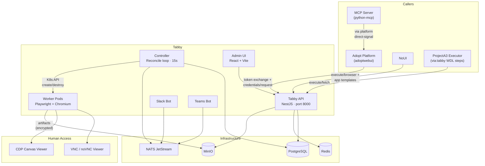
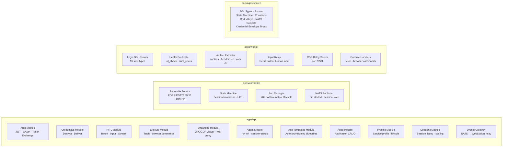
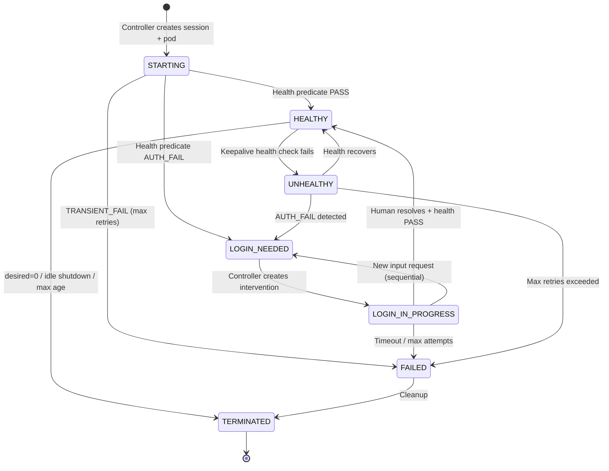
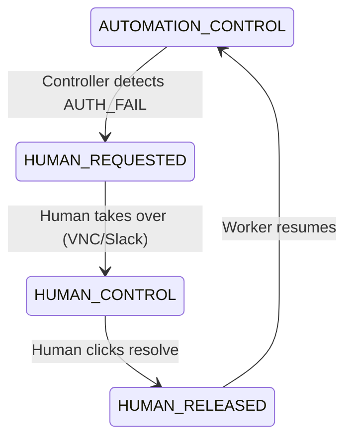
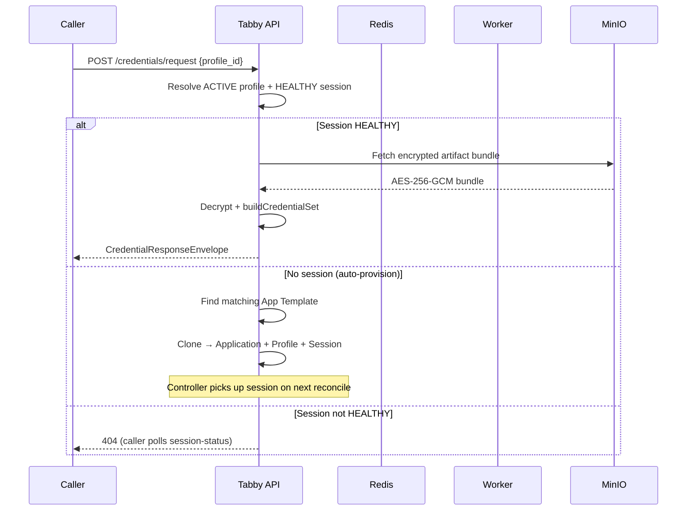
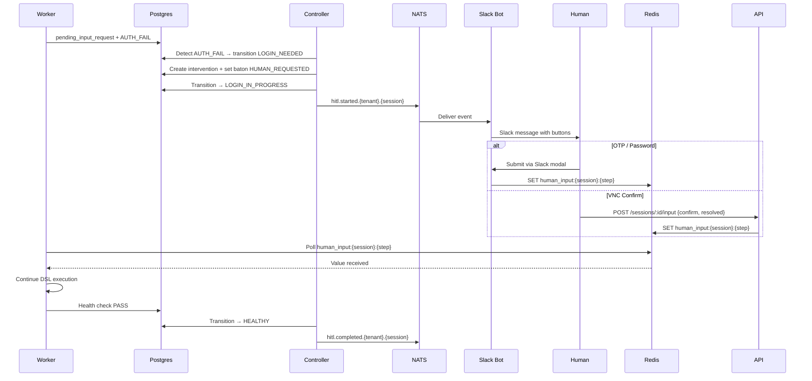
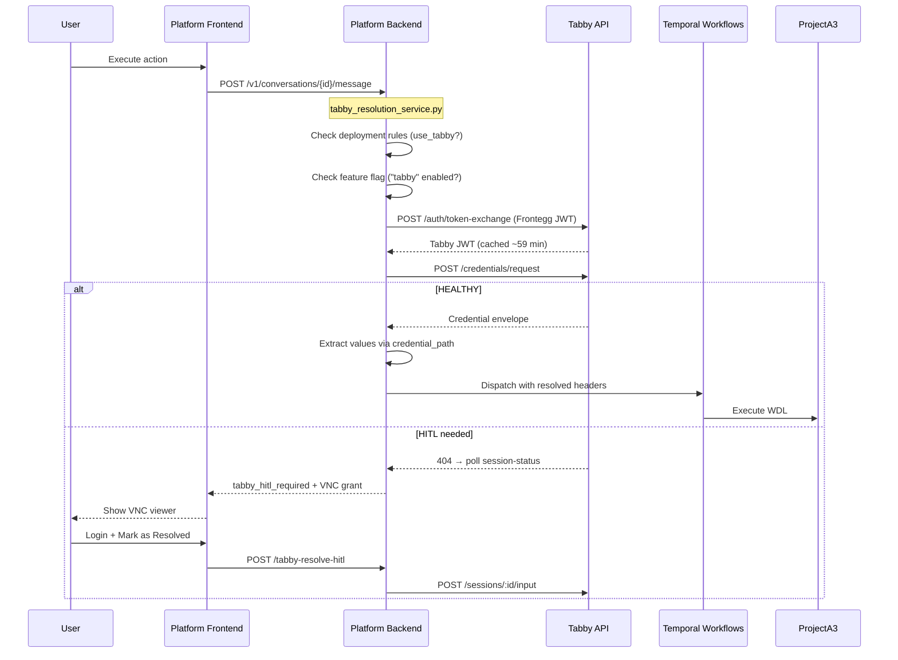
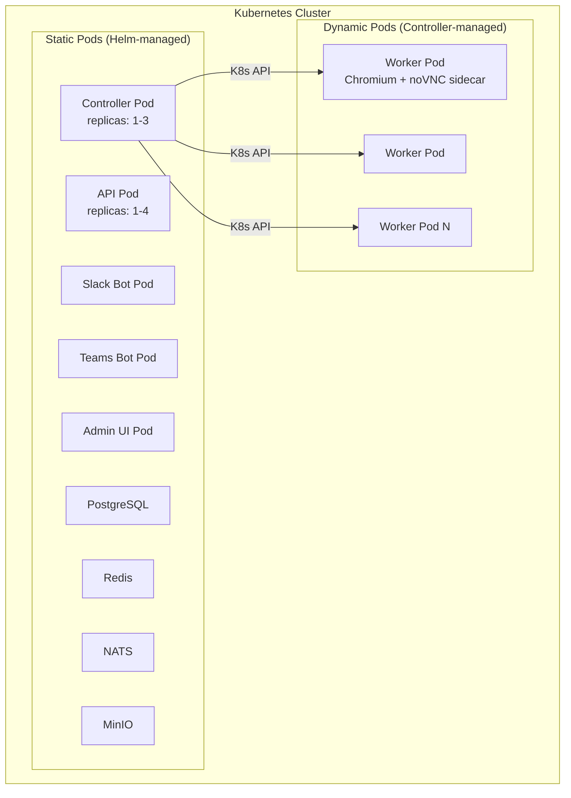
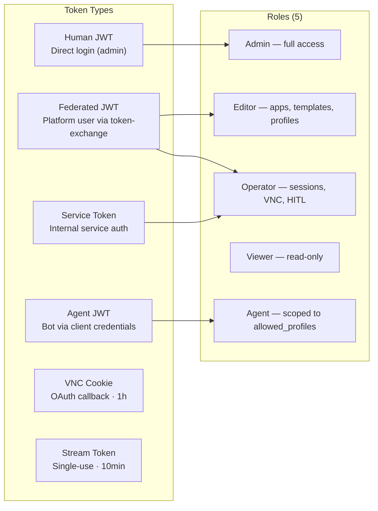

# Tabby — High-Level Architecture

## System Context

Tabby is a browser infrastructure service that provisions Chromium sessions, automates login flows, handles human-in-the-loop (HITL) intervention, and extracts credentials (cookies, tokens, headers) for AI agent consumption.

## Internal Components

## Session State Machine

## Baton State Machine

## Credential Request Flow

## HITL Flow

## Platform Integration

## Deployment Architecture

### Cloud vs On-Prem

| Aspect | Cloud (TrueFoundry) | On-Prem (Helm) |
|---|---|---|
| Deployment | `tfy apply` (ArgoCD) | `helm upgrade` |
| Chart | `adopt-tabby` subchart in `adoptapp` umbrella | Standalone `browser-hitl` chart |
| Images | `ghcr.io/adoptai/tabby/*` | Customer registry |
| Ingress | Istio VirtualService | Ingress / VirtualService |
| Hosts | `tabby-api.*` + `tabby-admin.*` (two-host required) | Same |
| IdP | Frontegg (shared) | Customer IdP (OIDC/SAML) |
| Infra | Embedded PG/Redis/NATS/MinIO | External managed services supported |

## Authentication

## Key Data Stores

| Store | What it holds |
|---|---|
| **PostgreSQL** | Tenants, users, applications, sessions, profiles, interventions, artifacts, audit log, circuit breaker, IdP config, agent clients, app templates |
| **Redis** | Human input relay, stream tokens, JWT blacklist, extract locks, OAuth state, short links, VNC auth, rate limits |
| **NATS JetStream** | `hitl.started.*`, `hitl.completed.*`, `session.state.changed.*`, `auth.bundle.exported.*` |
| **MinIO** | Encrypted credential artifact bundles (AES-256-GCM) |

## Key Ports

| Service | Port |
|---|---|
| API | 8000 |
| Controller health | 8090 |
| Worker health | 8091 |
| Admin UI | 8000 |
| noVNC sidecar | 6080 |
| CDP relay | 9223 |
