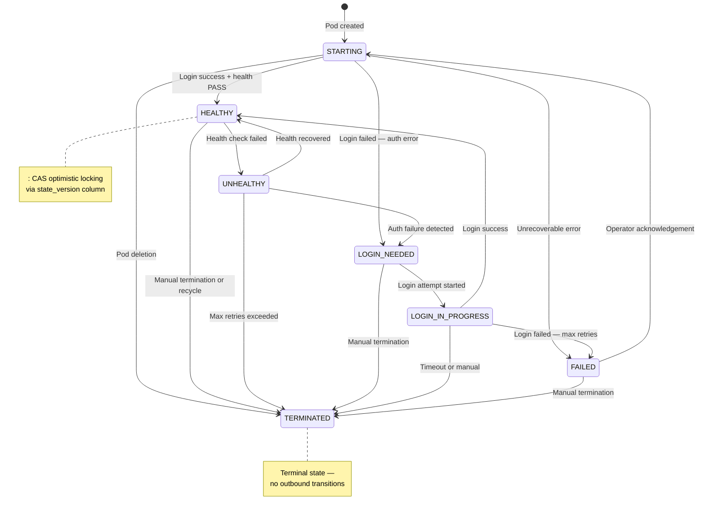
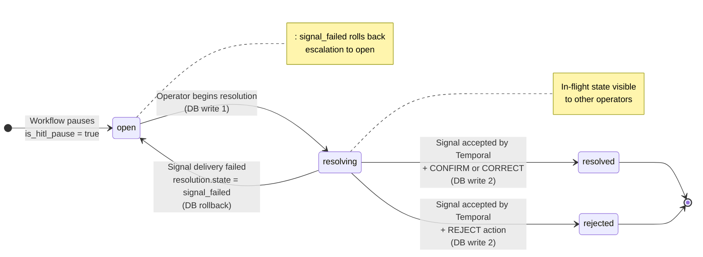
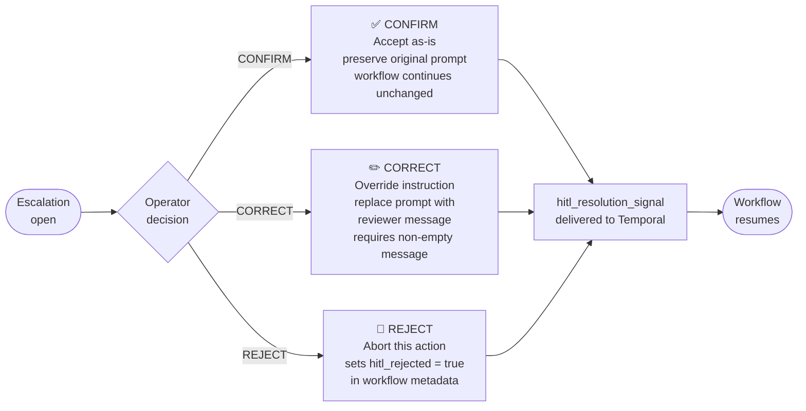
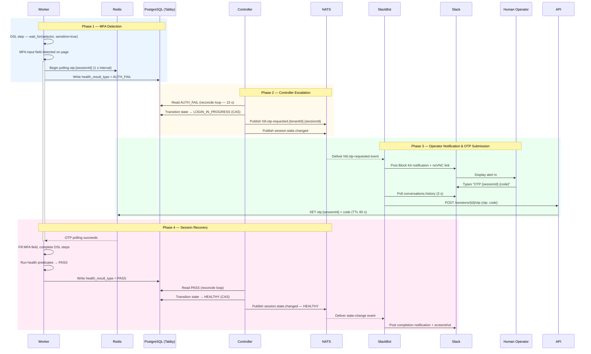
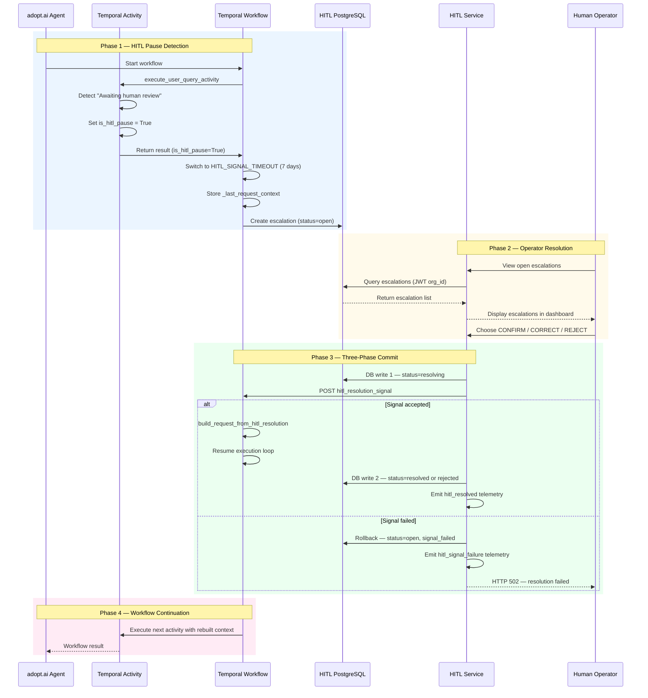
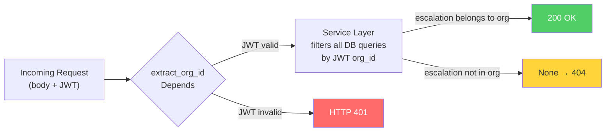
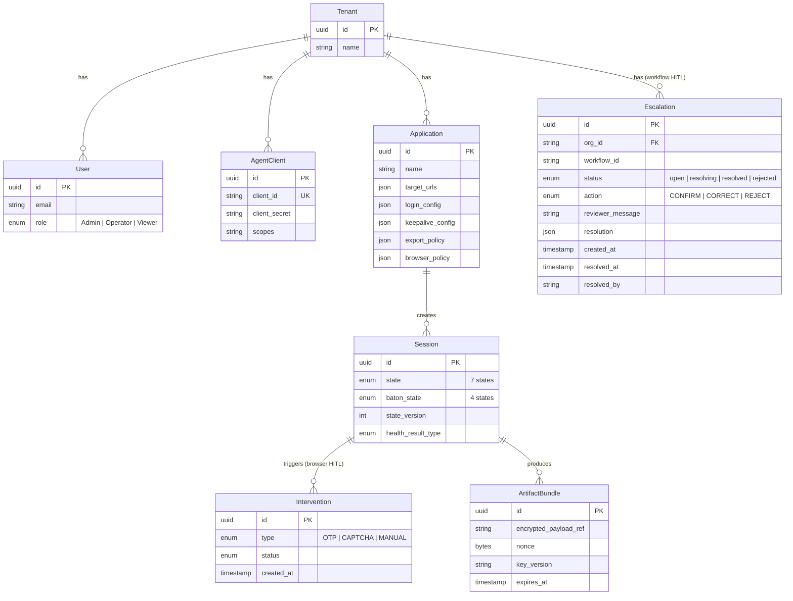

# Tabby: Technical Architecture Design

**Browser HITL (Human-in-the-Loop) System — adopt.ai Ecosystem**

> **Version:** 2.0
> **Date:** 2026-03-06
> **Status:** Living Document

---

## Table of Contents

1. [Executive Summary](#1-executive-summary)
2. [System Architecture](#2-system-architecture)
3. [Session Lifecycle & State Machine](#3-session-lifecycle--state-machine)
4. [HITL Ecosystem](#4-hitl-ecosystem)
  - 4.1 [HITL Dashboard (hitlintervention)](#41-hitl-dashboard-hitl_intervention)
  - 4.2 [Escalation State Machine](#42-escalation-state-machine)
  - 4.3 [Resolution Protocol — 3-Action Model](#43-resolution-protocol--3-action-model)
5. [HITL Data Flow](#5-hitl-data-flow)
  - 5.1 [Browser Auth Challenge Flow (Tabby → Slack/Teams)](#51-browser-auth-challenge-flow-tabby--slackteams)
  - 5.2 [Workflow Escalation Flow (Temporal → HITL Dashboard)](#52-workflow-escalation-flow-temporal--hitl-dashboard)
6. [Component Deep Dive](#6-component-deep-dive)
  - 6.1 [Worker Pods](#61-worker-pods)
  - 6.2 [Egress Proxy](#62-egress-proxy)
  - 6.3 [Stealth Browser Strategy](#63-stealth-browser-strategy)
7. [Security Architecture](#7-security-architecture)
8. [Future Roadmap](#8-future-roadmap)
9. [Appendix: Entity Relationship Overview](#9-appendix-entity-relationship-overview)

---

## 1. Executive Summary

adopt.ai agents operate enterprise SaaS platforms on behalf of customers — Salesforce, HubSpot, ServiceNow, Workday, and hundreds of others. These agents need real browser credentials (cookies, session tokens, CSRF tokens, headers) to make authenticated calls. Acquiring those credentials is hard because enterprise login flows are protected by layered defenses:


| Challenge                       | Example                                    | Why Automation Fails                                     |
| ------------------------------- | ------------------------------------------ | -------------------------------------------------------- |
| **Multi-Factor Authentication** | Google Authenticator TOTP, SMS codes       | Requires a human to read a code from their phone         |
| **CAPTCHA**                     | reCAPTCHA, hCaptcha, Cloudflare Turnstile  | Designed specifically to block bots                      |
| **Device Verification**         | "We don't recognize this device" email/SMS | Requires human to click a verification link              |
| **Behavioral Analysis**         | Typing speed, mouse movement patterns      | Detects that input is programmatic, not human            |
| **Browser Fingerprinting**      | Canvas, WebGL, audio context checks        | Detects headless/automated browser environments          |
| **IP Reputation**               | Datacenter IP ranges flagged as suspicious | Cloud-hosted browsers look different from office laptops |


These challenges surface unpredictably — a login that works Monday may demand MFA on Wednesday because a cookie expired or the IP changed.

**What Tabby does.** Tabby maintains persistent authenticated browser sessions — each backed by a dedicated Chromium instance in a Kubernetes pod — with human-in-the-loop (HITL) intervention for challenges automation cannot defeat. When an agent requests credentials, Tabby either returns a cached bundle from a live session or orchestrates a fresh login, escalating to a human only when it hits an MFA wall, CAPTCHA, or device prompt. Sessions stay alive for up to 24 hours via periodic health checks, credential re-extraction, and automatic recycling. Credentials are delivered as structured envelopes with freshness metadata (`CACHED | EXTRACTED | ON_DEMAND | DEGRADED`) and per-field volatility (`STABLE | SEMI_STABLE | VOLATILE`).

**Freshness** tells the agent how much to trust the credentials:
- `CACHED` — from a previously extracted bundle, might be stale
- `EXTRACTED` — freshly extracted from a live browser session
- `ON_DEMAND` — extracted specifically for this request (most expensive)
- `DEGRADED` — best-effort, the session is unhealthy

**Volatility** tells the agent how to handle each field:
- `STABLE` — rarely changes (e.g., auth cookies with long TTL)
- `SEMI_STABLE` — changes periodically (e.g., session cookies)
- `VOLATILE` — changes every request (e.g., CSRF tokens)

**Request coalescing.** Enterprise apps enforce account lockout (e.g., 5 failed logins in 15 minutes locks everyone). If 10 agents request credentials simultaneously, Tabby coalesces them into a single login via a three-barrier defense: a Redis distributed lock (one login per app, 5-min TTL), a PostgreSQL `SELECT ... FOR UPDATE` serialization gate, and a per-worker rate limit (60 s minimum between attempts).

**Beyond browser auth.** The adopt.ai platform also requires human intervention when AI workflows themselves get stuck — ambiguous instructions, flagged content, or sensitive decisions. This is handled by the **HITL Dashboard** (`hitl_intervention`), which manages escalation records and delivers operator decisions (CONFIRM / CORRECT / REJECT) back to paused Temporal workflows via `hitl_resolution_signal`. Both `hitl_intervention` and `adoptwebui` share write access to the same escalation store.

---

## 2. System Architecture

Tabby deploys as a single Helm chart with seven microservices and four backing stores. The broader HITL ecosystem adds three independently deployed services: `hitl_intervention` (operator dashboard), `adoptwebui` (admin platform with HITL management routes), and `adoptai-workflows` (Temporal worker for AI workflow execution).

```mermaid
graph TB
    subgraph External["✦ External Actors"]
        direction LR
        Agents{{"adopt.ai Agents"}}
        Humans{{"Human Operators"}}
    end

    subgraph OperatorUI["Operator Interfaces"]
        AdminUI["🖥 Admin UI
adoptwebui · :3000
HITL management routes"]
        HITLDash["🧑‍💻 HITL Dashboard
hitl_intervention
FastAPI + React"]
    end

    subgraph TabbyStack["Tabby — Browser Session Management"]
        subgraph APItier["API Tier"]
            API["Tabby API
NestJS · :8080
20 modules · 13 controllers"]
        end

        subgraph Notifications["Notification Tier"]
            SlackBot["Slack Bot
NATS subscriber"]
            TeamsBot["Teams Bot
NATS subscriber · :3978"]
        end

        subgraph Orchestration["Orchestration Tier"]
            Controller["Controller
NestJS · :8090
Reconcile loop 15 s · Pod lifecycle"]
            K8sAPI["Kubernetes API"]
        end

        subgraph Workers["Worker Tier"]
            subgraph VNCMode["VNC Mode — Headed"]
                WkrVNC["Worker · Chromium + Xvfb
:8091"]
                NoVNC["noVNC Sidecar
:6080"]
            end
            subgraph CDPMode["CDP Mode — Headless"]
                WkrCDP["Worker · Chromium headless
:8091"]
                CDPRelay["CDP Relay
:9223"]
            end
        end

        subgraph EgressTier["Egress Tier"]
            EgressProxy["Egress Proxy
:3128 · FQDN allowlist"]
        end
    end

    subgraph WorkflowStack["Workflow Orchestration — adoptai-workflows"]
        Temporal["Temporal Worker
NLWDLExecutionWorkflow
hitl_resolution_signal
user_input_signal"]
    end

    subgraph TabbyStores["Tabby Backing Stores"]
        PostgreSQL[("PostgreSQL :5432
15 tables · RLS")]
        Redis[("Redis :6379
OTP relay · Locks")]
        NATS[("NATS JetStream :4222
Durable event bus")]
        MinIO[("MinIO :9000
Encrypted artifacts")]
    end

    subgraph HITLStore["HITL Backing Store"]
        HITLDb[("HITL PostgreSQL
Escalations
Interventions
Messages")]
    end

    Internet(["🌐 Internet
Salesforce · HubSpot · ServiceNow · etc."])

    %% External entry points
    Agents -->|"POST /agent/credentials
OAuth 2.0 Client Credentials"| API
    Humans --> AdminUI
    Humans --> HITLDash
    Humans -->|"OTP · VNC"| SlackBot
    Humans -->|"OTP · VNC"| TeamsBot

    %% Operator UI → HITL resolution
    AdminUI -->|"CONFIRM / CORRECT / REJECT
three-phase commit"| HITLDb
    AdminUI -->|"hitl_resolution_signal"| Temporal
    HITLDash -->|"CONFIRM / CORRECT / REJECT
three-phase commit"| HITLDb
    HITLDash -->|"hitl_resolution_signal"| Temporal

    %% Tabby API
    API <--> PostgreSQL
    API <--> Redis
    API -->|"publish events"| NATS

    %% Controller
    Controller <--> PostgreSQL
    Controller -->|"create · delete pods"| K8sAPI
    Controller -->|"publish state changes"| NATS

    %% Notification bots
    NATS -.->|"hitl.* events"| SlackBot
    NATS -.->|"hitl.* events"| TeamsBot
    SlackBot -->|"POST /sessions/:id/otp"| API
    TeamsBot -->|"POST /sessions/:id/otp"| API

    %% Workers
    WkrVNC --> PostgreSQL & Redis & MinIO
    WkrVNC -.->|"artifact export events"| NATS
    WkrCDP --> PostgreSQL & Redis & MinIO
    WkrCDP -.->|"artifact export events"| NATS

    %% Egress
    WkrVNC --> EgressProxy
    WkrCDP --> EgressProxy
    EgressProxy --> Internet

    %% Workflow HITL escalation path
    Temporal -->|"is_hitl_pause = true
escalation created"| HITLDb
    Temporal -.->|"workflow paused
7-day HITL_SIGNAL_TIMEOUT"| Temporal

    %% Human streams
    Humans -.->|"VNC · CDP streams via API"| API
```




### Services


| Service             | Technology                          | Port        | Purpose                                                                                   |
| ------------------- | ----------------------------------- | ----------- | ----------------------------------------------------------------------------------------- |
| **Tabby API**       | NestJS                              | 8080        | REST API surface (20 modules, 13 controllers), Swagger at `/api/docs`                     |
| **Controller**      | NestJS standalone                   | 8090        | Sole writer of Tabby session state, reconcile loop (15 s), Kubernetes pod lifecycle       |
| **Worker**          | Node.js + Playwright                | 8091        | Browser automation, login DSL execution, artifact extraction, health predicate evaluation |
| **Slack Bot**       | Node.js                             | —           | NATS JetStream subscriber; posts Block Kit notifications and relays OTP codes             |
| **Teams Bot**       | Node.js + Bot Framework             | 3978        | NATS JetStream subscriber; posts adaptive card notifications to Microsoft Teams           |
| **Admin UI**        | Static JS (adoptwebui)              | 3000        | Operator dashboard for session monitoring, HITL management, and system health             |
| **Egress Proxy**    | Node.js                             | 3128 / 8095 | FQDN allowlist enforcement with session-scoped HMAC credentials, fail-closed policy       |
| **HITL Dashboard**  | FastAPI + React (hitl_intervention) | —           | Real-time operator dashboard for AI workflow escalation review and resolution             |
| **Temporal Worker** | Python (adoptai-workflows)          | —           | Durable AI workflow execution; handles `hitl_resolution_signal` and `user_input_signal`   |


### Backing Stores


| Store                  | Technology    | Purpose                                                                                                 |
| ---------------------- | ------------- | ------------------------------------------------------------------------------------------------------- |
| **PostgreSQL (Tabby)** | v16           | Primary Tabby datastore — 15 entities, Row-Level Security, hash-chained audit log                       |
| **Redis**              | v7            | Ephemeral coordination — OTP relay via `otp:{sessionId}` keys, distributed locks                        |
| **NATS JetStream**     | v2.10         | Durable event bus — tenant-scoped subjects, at-least-once delivery for HITL and state-change events     |
| **MinIO**              | S3-compatible | Encrypted artifact storage — AES-256-GCM bundles in per-tenant buckets                                  |
| **PostgreSQL (HITL)**  | v16           | HITL escalation store — escalations, interventions, messages; shared by hitlintervention and adoptwebui |


### Multi-Tenant Isolation

Tenant isolation is enforced at every layer:


| Layer              | Mechanism                                                                          |
| ------------------ | ---------------------------------------------------------------------------------- |
| **PostgreSQL**     | Row-Level Security on all tables — queries scoped to requesting tenant             |
| **NATS**           | Tenant-namespaced subjects (e.g., `session.state.changed.{tenantId}.{sessionId}`)  |
| **MinIO**          | Per-tenant buckets (`artifact-bundles-{tenantId}`)                                 |
| **Encryption**     | Per-tenant AES-256-GCM keys with key version tracking for rotation                 |
| **RBAC**           | Four roles (Admin, Operator, Viewer, Agent) enforced across all 13 API controllers |
| **HITL Dashboard** | `org_id` extracted exclusively from JWT — never accepted from request bodies       |


### Entity Relationships

```
Tenant
  └── User (Admin, Operator, Viewer)
  └── AgentClient (OAuth 2.0 client credentials)
  └── Application (e.g., "Salesforce Production")
       ├── login_config (Login DSL steps)
       ├── keepalive_config (health checks, interval)
       ├── export_policy (artifact types, TTL, header allowlist)
       ├── browser_policy (downloads, clipboard, file_chooser, streaming_mode)
       └── Session (1:N per app, managed by Controller)
            ├── state (STARTING → HEALTHY → ... → TERMINATED)
            ├── baton_state (AUTOMATION_CONTROL / HUMAN_CONTROL)
            ├── Intervention (OTP, CAPTCHA, MANUAL)
            └── ArtifactBundle (encrypted credentials in MinIO)
```

### Helm Chart

The entire stack deploys via a single Helm chart at `charts/browser-hitl/` with 26 templates and 3 values tiers:
- `values.yaml` — defaults
- `values-local.yaml` — Kind/minikube overrides
- `values-production.yaml` — production hardening

---

## 3. Session Lifecycle & State Machine

Every browser session progresses through a deterministic seven-state machine. Transitions follow a strict allowlist in `packages/shared/src/state-machine.ts` — no shortcuts are possible (e.g., `HEALTHY` cannot jump directly to `LOGIN_NEEDED`).


| State                 | Meaning                                                  | Transitions to                            |
| --------------------- | -------------------------------------------------------- | ----------------------------------------- |
| **STARTING**          | Pod created, browser launching, login DSL executing      | HEALTHY, LOGIN_NEEDED, FAILED, TERMINATED |
| **HEALTHY**           | Authenticated, credentials fresh, keepalive active       | UNHEALTHY, TERMINATED                     |
| **UNHEALTHY**         | Health check failed, 2-min escalation delay              | HEALTHY, LOGIN_NEEDED, TERMINATED         |
| **LOGIN_NEEDED**      | Re-authentication required, login queued                 | LOGIN_IN_PROGRESS, TERMINATED             |
| **LOGIN_IN_PROGRESS** | Login DSL executing, HITL may be active (10-min timeout) | HEALTHY, FAILED, TERMINATED               |
| **FAILED**            | Unrecoverable error, requires operator ack               | STARTING, TERMINATED                      |
| **TERMINATED**        | Final state, pod deleted                                 | *(none)*                                  |





### Controller as Sole Writer

The Controller is the exclusive writer of session state. Transitions use **CAS (Compare-And-Swap)** optimistic locking via a `state_version` column:

```sql
UPDATE sessions
SET state = $new_state, state_version = state_version + 1
WHERE id = $session_id AND state_version = $expected_version;
```

If zero rows match, a concurrent modification occurred and the Controller retries with fresh data. This eliminates race conditions between the 15 s reconcile loop, NATS event handlers, and API requests without heavyweight distributed locks.

### The Baton System

When HITL is needed (MFA, CAPTCHA, device verification), browser ownership transfers via a four-state baton:

**AUTOMATION_CONTROL** → **HUMAN_REQUESTED** → **HUMAN_CONTROL** → **HUMAN_RELEASED** → **AUTOMATION_CONTROL**

If no human accepts within 10 minutes of `HUMAN_REQUESTED`, the baton reverts automatically and the session transitions toward failure.

### Retry Matrix and Circuit Breakers


| Scenario                | Max Attempts | Backoff                                 |
| ----------------------- | ------------ | --------------------------------------- |
| STARTING fails          | 3            | Exponential (30 s base, 2×, 30-min cap) |
| UNHEALTHY (transient)   | 3            | Exponential                             |
| UNHEALTHY (auth fail)   | 1            | None — straight to LOGIN_NEEDED         |
| LOGIN_IN_PROGRESS fails | 3            | Exponential                             |
| FAILED                  | 0            | Requires operator acknowledgement       |


**Circuit breakers** prevent cascading failures:

- **Per-app:** 5 failures in 15 min → pause that app
- **Per-tenant:** 15 failures in 15 min → pause that tenant
- **HITL fatigue:** 3 consecutive HITL failures → 30-min cooldown

---

## 4. HITL Ecosystem

Two intervention modalities exist: **browser-level** (MFA/CAPTCHA via OTP relay and VNC, handled within Tabby) and **workflow-level** (AI agent pauses requiring human judgement, handled by `hitl_intervention` + Temporal). Both share the same principle: notify a human, collect a decision, deliver it back to the blocked process.

### 4.1 HITL Dashboard (`hitl_intervention`)

Standalone FastAPI + React service for workflow escalation resolution. Deployed independently of Tabby; communicates with the shared HITL PostgreSQL store and Temporal.

**Backend — four-layer pattern:**


| Layer          | File                                   | Responsibility                                                                                       |
| -------------- | -------------------------------------- | ---------------------------------------------------------------------------------------------------- |
| **Route**      | `app/routes/interventions.py`          | Thin delegation — zero SQLAlchemy or HTTP client imports; all logic delegated to service             |
| **Service**    | `app/services/intervention_service.py` | Business logic, DB queries, three-phase commit, Temporal signal dispatch, telemetry                  |
| **Schema**     | `app/schemas/hitl.py`                  | Pydantic models: `EscalationSummary`, `EscalationDetail`, `EscalationListResponse`, `ResolveRequest` |
| **Dependency** | `app/dependencies/hitl.py`             | FastAPI `Depends` injector for `InterventionService`                                                 |


**Frontend:** React with real-time escalation list, `TaskDetailPanel` (details + conversation thread + resolution bar), status badge color coding (open/resolving/resolved/rejected), and XSS-sanitized content rendering.

**Feature controls:** `HITL_RESOLVE_ENABLED` (kill switch — returns 503 when false) and `HITL_CANARY_ORGS` (comma-separated org IDs permitted during canary rollout).

**Shared access model.** `adoptwebui` implements an identical HITL service layer (`app/services/hitl_service.py`) with the same four endpoints against the same HITL PostgreSQL store. Both surfaces use the same three-phase commit and Temporal signaling logic.

### 4.2 Escalation State Machine

Escalation records progress through a five-state machine enforced by the three-phase commit:




**Three-phase commit:**

1. **Lock:** Set `status = resolving` and commit (prevents double-resolution)
2. **Signal:** POST `hitl_resolution_signal` to Temporal with escalation ID, org ID, action, and reviewer message
3. **Confirm or Rollback:** On success → `resolved` or `rejected`. On failure → rollback to `open` with `signal_failed`, return HTTP 502

Already-resolved escalations return `already_resolved` without any writes or signals (idempotent).

### 4.3 Resolution Protocol — 3-Action Model

The operator picks one of three actions:




| Action      | Prompt sent to workflow                                            | Metadata effect                 | Message required |
| ----------- | ------------------------------------------------------------------ | ------------------------------- | ---------------- |
| **CONFIRM** | Original prompt preserved                                          | —                               | No               |
| **CORRECT** | Reviewer message replaces original                                 | `hitl_resolution` dict attached | **Yes**          |
| **REJECT**  | Reviewer message (or default: *"Escalation rejected by reviewer"*) | `hitl_rejected: true`           | No               |


**Temporal signal contract.** The `hitl_resolution_signal` handler calls `build_request_from_hitl_resolution(last_request_context, payload)` to reconstruct a workflow request from context + operator payload. The signal name is distinct from `user_input_signal` to prevent conflation between user sessions and HITL responses.

**HITL pause timeout.** When a workflow activity detects `"Awaiting human review"`, it sets `is_hitl_pause = True`. The workflow switches its signal wait from 2 minutes to **7 days** (`HITL_SIGNAL_TIMEOUT`).

---

## 5. HITL Data Flow

Two distinct HITL flows exist: browser auth challenges (MFA/CAPTCHA via OTP relay) and AI workflow pauses (via Temporal signals).

### 5.1 Browser Auth Challenge Flow (Tabby → Slack/Teams)

When a session hits an MFA prompt, Tabby bridges the stuck browser to a human operator via OTP relay:




**Step-by-step:**

1. **MFA detection.** Worker DSL hits `wait_for(selector, sensitive=true)` → detects MFA field on page.
2. **OTP relay starts.** Worker begins polling Redis `otp:{sessionId}` at 1 s intervals (120 s timeout).
3. **Health escalation.** Worker writes `AUTH_FAIL` to PostgreSQL.
4. **Controller reacts.** Reconcile loop reads `AUTH_FAIL` → transitions to `LOGIN_IN_PROGRESS` → publishes `hitl.otp-requested` and `session.state.changed` to NATS.
5. **Operator notified.** Slack/Teams bot receives NATS event → posts Block Kit message with app name, session ID, noVNC link, and OTP instructions.
6. **Human submits OTP.** Operator types `OTP <session-id> <code>` in Slack. Bot polls `conversations.history` every 3 s.
7. **OTP delivered.** Bot calls `POST /sessions/{id}/otp` → API writes to Redis (60 s TTL) → Worker reads, fills field, continues DSL.
8. **Recovery.** Health predicates pass → Worker writes `PASS` → Controller transitions to `HEALTHY` → Slack posts completion + screenshot.

### 5.2 Workflow Escalation Flow (Temporal → HITL Dashboard)

When a workflow activity cannot proceed without human review, it sets `is_hitl_pause = True` → Temporal switches to a 7-day wait → an escalation record is created → an operator resolves it via the HITL Dashboard or adoptwebui.




---

## 6. Component Deep Dive

### 6.1 Worker Pods

Each session gets a dedicated K8s pod with Chromium. Two modes:


| Mode               | Containers                                       | Streaming         | Use case                                         |
| ------------------ | ------------------------------------------------ | ----------------- | ------------------------------------------------ |
| **VNC** (default)  | Worker (Chromium + Xvfb) + noVNC sidecar (:6080) | VNC via WebSocket | HITL-heavy apps — operators can see and interact |
| **CDP** (headless) | Worker (Chromium headless + CDP relay :9223)     | CDP screencast    | Lightweight, rare HITL                           |


**Startup sequence (4 phases):**

1. **Entrypoint** — VNC: start Xvfb → x11vnc → Node.js. CDP: exec Node.js directly.
2. **Init** — Load env vars, connect DB, start health server (:8091), launch Chromium (17 hardening flags), create 1920×1080 context, apply browser policy, start CDP relay if needed.
3. **Login** — Resolve credentials from K8s Secrets, register header capture, execute login DSL, run health predicate, extract artifacts on success.
4. **Steady state** — Keepalive loop (300 s), recycling monitor (memory > 2.5 GB or age > 24 h), screenshot fallback (VNC FPS < 1 for 30 s).

**Login DSL.** Each app's login flow is a JSON array in `applications.login_config.steps`. Fifteen actions:


| Action         | Purpose                                                                          |
| -------------- | -------------------------------------------------------------------------------- |
| `goto`         | Navigate to a URL                                                                |
| `fill`         | Set an input field's value instantly                                             |
| `type`         | Type with per-keystroke delay (50 ms)                                            |
| `click`        | Click a DOM element                                                              |
| `select`       | Choose a dropdown option                                                         |
| `wait_for`     | Wait for an element to appear (with optional `sensitive: true` for HITL trigger) |
| `wait_for_url` | Wait for the URL to match a pattern                                              |
| `frame`        | Switch execution context to an iframe                                            |
| `main_frame`   | Return to the top-level frame                                                    |
| `popup`        | Wait for and switch to a popup window                                            |
| `keyboard`     | Press a key (e.g., Enter)                                                        |
| `evaluate`     | Execute JavaScript in the page context (gated by browser policy)                 |
| `sleep`        | Pause for a fixed duration                                                       |
| `screenshot`   | Capture the current viewport to `/tmp/`                                          |
| `reload`       | Reload the current page                                                          |


`${USERNAME}` and `${PASSWORD}` are interpolated at runtime. Credential values never appear in logs or screenshots. `sensitive: true` on `wait_for` is the primary HITL trigger.

**Credential resolution.** K8s Secrets mounted at `/var/run/secrets/browser-hitl/{secret-name}/` containing `username` and `password` files. Env fallback exists for local dev only (`WORKER_ALLOW_ENV_CREDENTIAL_FALLBACK=true`).

**Artifact extraction pipeline (4 stages):**

1. **Extract** — cookies (filtered to `target_urls`), headers (allowlisted), CSRF tokens, localStorage, sessionStorage
2. **Encrypt** — AES-256-GCM, per-tenant key, 12-byte random nonce → `[nonce][ciphertext][auth tag]`
3. **Upload** — MinIO at `artifact-bundles-{tenantId}/{appId}/{sessionId}/{timestamp}.enc`
4. **Publish** — NATS `auth.bundle.exported.{tenantId}.{appId}` with bundle ref, key version, expiry

**Health predicates:**


| Type            | Mechanism                                   | Notes                                           |
| --------------- | ------------------------------------------- | ----------------------------------------------- |
| `url_check`     | HTTP GET with session cookies, check status | `redirect: 'manual'` — catches login redirects  |
| `dom_check`     | `page.locator(selector).waitFor()`          | Verify auth-proving element (e.g., user avatar) |
| `network_check` | HTTP GET with cookies + body matching       | `redirect: 'manual'` — body content validation  |


**Keepalive loop.** Every 300 s: reload config from DB → run keepalive DSL actions → wait 2 s → run health predicates → re-extract artifacts if stale. **Recycling monitor** checks every 30 s for memory > 2.5 GB or age > 24 h → final extraction → `TRANSIENT_FAIL` → Controller terminates and recreates the pod.

### 6.2 Egress Proxy

Workers run untrusted browser sessions. The Egress Proxy prevents cookie exfiltration, internal service access, and network scanning by enforcing FQDN allowlisting on all outbound traffic.

All Chromium instances use `--proxy-server=http://egress-proxy:3128`. The proxy checks `CONNECT` hostnames against the allowlist — permitted → TCP tunnel, denied → HTTP 403.

**Two-layer allowlist:**

- **Default** (Helm values) — global domains for all sessions (CDNs, identity providers)
- **Session-scoped** — Controller sets via `PUT /allowlist` on admin port 8095, derived from app's `target_urls`. A HubSpot session cannot reach Salesforce domains.

**Session-scoped HMAC credentials.** Username = session ID; password = `HMAC-SHA256(SESSION_KEY, sessionId)`. Prevents cross-session allowlist access.

**Fail-closed.** Unknown hostnames denied by default. If the proxy goes down, workers lose all internet → `UNHEALTHY`, not silent exfiltration.

**NetworkPolicy.** Per-pod K8s `NetworkPolicy` restricts egress to: egress proxy, PostgreSQL, Redis, NATS, MinIO, and DNS. All other egress denied at CNI level.

### 6.3 Stealth Browser Strategy

> **CRITICAL: This section distinguishes between what was DESIGNED (in ADR-004) and what is actually IMPLEMENTED in code. Read carefully.**

#### ADR-004: The Three-Tier Strategy (DESIGNED)

ADR-004 (`docs/ARCHITECTURE_DECISIONS.md`) defines a comprehensive anti-bot strategy with three tiers:

**Tier 1: Evasion (Reduce Detection Surface) — PARTIALLY IMPLEMENTED**

| Measure | Status | Notes |
|---------|--------|-------|
| Remove `navigator.webdriver` via `--disable-blink-features=AutomationControlled` | **NOT DONE** | `--enable-automation` is still in CHROMIUM_FLAGS (does the opposite!) |
| Realistic user-agent | **NOT DONE** | Using Playwright's default UA |
| Human-like typing jitter (50-200ms random) | **PARTIAL** | `type` action uses fixed 50ms delay, no randomization |
| Mouse movement simulation (bezier curves) | **NOT DONE** | |
| Consistent canvas/WebGL fingerprint | **NOT DONE** | |
| Realistic viewport (1920x1080) | **DONE** | `viewport: { width: 1920, height: 1080 }` in `main.ts` |
| Timezone consistency | **NOT DONE** | |
| WebRTC leak prevention | **NOT DONE** | |

**Tier 2: Detection (Monitor Anti-Bot Friction) — NOT IMPLEMENTED**

The entire friction health score system (0-100 score, GREEN/YELLOW/RED thresholds, CAPTCHA detection, login duration baseline comparison) is designed but has zero code. There is no `friction_health_score` metric, no CAPTCHA pattern matching, no adaptive jitter.

**Tier 3: Escalation (Human Fallback) — FULLY IMPLEMENTED**

This is the HITL system, and it works well:
- MFA/OTP detection via `sensitive: true` DSL steps → Slack/Teams notification → human submits code
- VNC stream for manual intervention (CAPTCHA solving, device verification)
- Baton system for ownership transfer (AUTOMATION_CONTROL ↔ HUMAN_CONTROL)

#### Current Chromium Flags (`packages/shared/src/constants.ts`)

```typescript
export const CHROMIUM_FLAGS = [
  '--no-sandbox',
  '--no-first-run',
  '--disable-extensions',
  '--disable-background-networking',
  '--disable-sync',
  '--metrics-recording-only',
  '--disable-default-apps',
  '--mute-audio',
  '--remote-debugging-address=127.0.0.1',
  '--remote-debugging-port=9222',
  '--disable-dev-shm-usage',
  '--disable-gpu',
  '--enable-automation',           // ← PROBLEM: makes navigator.webdriver = true
  '--password-store=basic',
  '--disable-component-extensions-with-background-pages',
  '--disable-client-side-phishing-detection',
  '--disable-dev-tools',
];
```

**The `--enable-automation` flag** is the most glaring anti-stealth issue. It sets `navigator.webdriver = true`, which is the single most common bot detection check. Any website running `if (navigator.webdriver) { ... }` will immediately flag the browser as automated.

#### CloakBrowser (Attempted, Failed)

There was an attempt to integrate the `cloak-browser` npm package for stealth patches (puppeteer-extra-plugin-stealth equivalent for Playwright). The package appears in the Docker image dependencies, but **it fails at runtime due to a package export/import issue**. The worker falls back to stock Playwright with no stealth patches applied.

#### What Needs to Be Done (Stealth TODO)

If stealth becomes a priority, here's the concrete action list:

1. **Remove `--enable-automation`** from `CHROMIUM_FLAGS` and add `--disable-blink-features=AutomationControlled`
2. **Fix or replace CloakBrowser** — either fix the import issue or port the necessary patches:
   - `navigator.webdriver` deletion
   - `navigator.plugins` spoofing (headless Chrome has 0 plugins)
   - `navigator.languages` normalization
   - `chrome.runtime` stub (headless Chrome missing this API)
   - WebGL vendor/renderer spoofing
3. **Add typing jitter** — randomize keystroke delay in `type` action (currently fixed 50ms)
4. **Add mouse movement simulation** — generate realistic bezier-curve paths before clicks
5. **Implement timezone consistency** — set `TZ` env var on worker pod matching the org's locale
6. **Implement Tier 2 friction detection** — CAPTCHA iframe pattern matching, login duration baselines

---

## 7. Security Architecture

### 7.1 Tenant Boundary Enforcement

`org_id` is **never** accepted from request bodies — extracted exclusively from JWT claims via `Depends(extract_org_id)`. Cross-tenant lookups return `None` (no error leakage).




### 7.2 XSS Sanitization

`formatMessageContent()` strips all HTML tags and markdown bold markers before rendering. No `dangerouslySetInnerHTML` in HITL components. Tested against 8 XSS vectors. SLO target: zero XSS findings.

### 7.3 CORS Policy

No wildcard origins — `APP_ALLOWED_ORIGINS` explicitly configured. `DELETE` method removed (unused). Minimal attack surface.

### 7.4 Temporal Signal Authentication

`hitl_resolution_signal` carries `escalation_id` and `org_id`. The workflow handler validates `_last_request_context` exists before processing — orphaned signals raise `ValueError` and are rejected deterministically.

---

## 8. Future Roadmap

### Dynamic Notification Routing

**Current state:** Slack and Teams bots subscribe to NATS events. No per-tenant or per-app routing configurability.

**Planned:** Configurable routing rules per tenant/app directing HITL events to Slack, Teams, email, dashboard, PagerDuty, or webhooks. Rules scoped by severity, application, or schedule. Not yet under active development — future ADR will formalize the routing schema and delivery guarantees.

### HITL Dashboard Unification

`hitl_intervention` and `adoptwebui` currently maintain independent service layers writing to the same DB. Future consolidation: single HITL API consumed by both frontends, eliminating duplicated three-phase commit logic.

---

## 9. Appendix: Entity Relationship Overview

**Tabby data model:** Tenant → Users (4 RBAC roles) + AgentClients (OAuth 2.0) + Applications (login_config, keepalive_config, export_policy, browser_policy) → Sessions (7-state machine, baton, health) → Interventions (OTP/CAPTCHA/manual) + ArtifactBundles (encrypted in MinIO).

**HITL data model:** Tenant → Escalations (scoped by `org_id`, linked to Temporal `workflow_id`). Each carries resolution metadata: action (CONFIRM/CORRECT/REJECT), reviewer message, resolution state.




