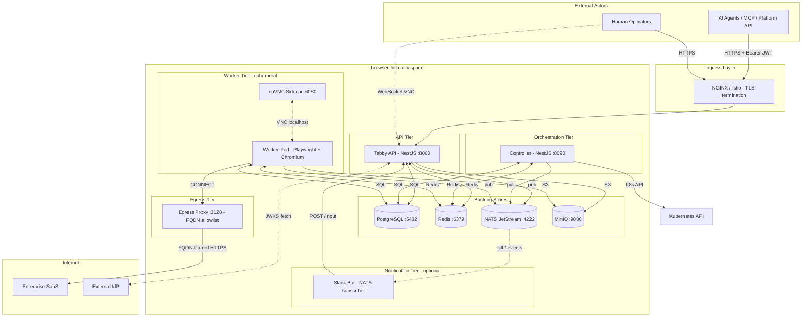
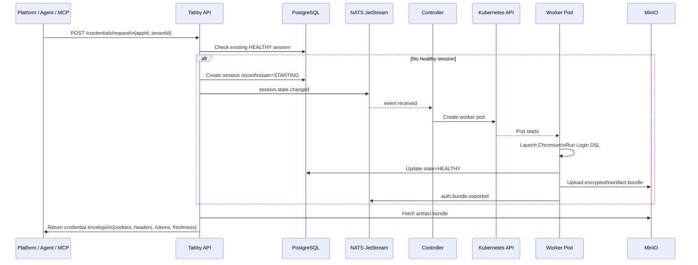
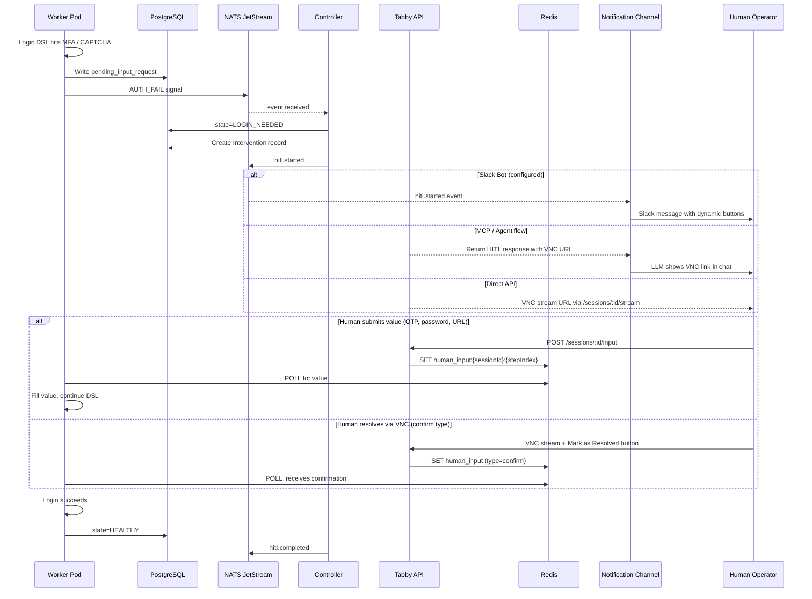
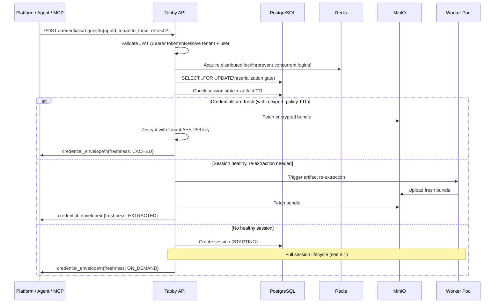
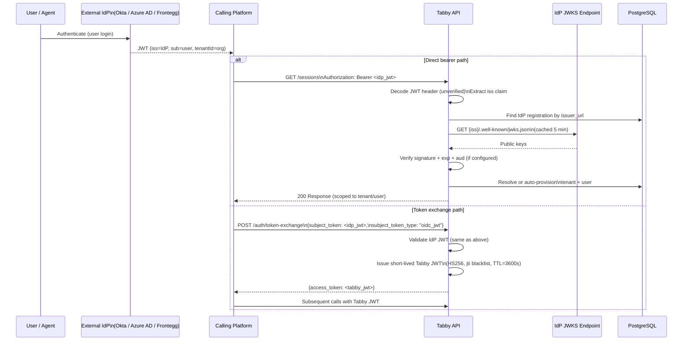
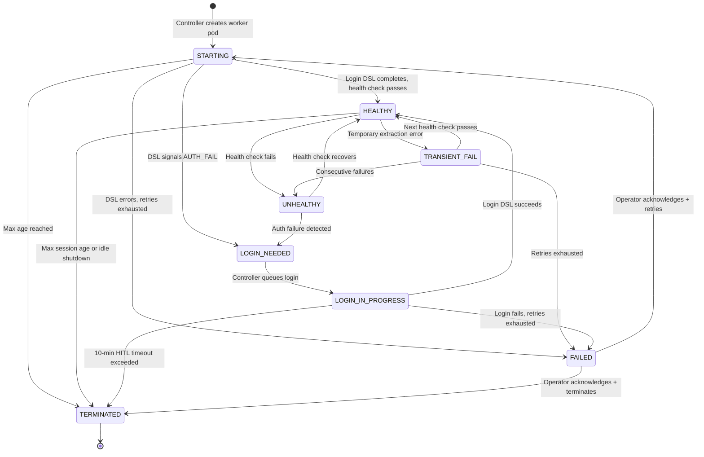
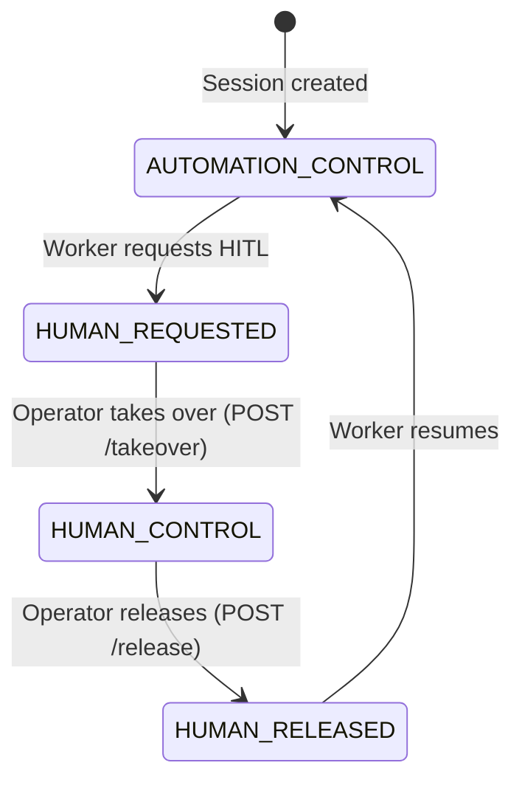
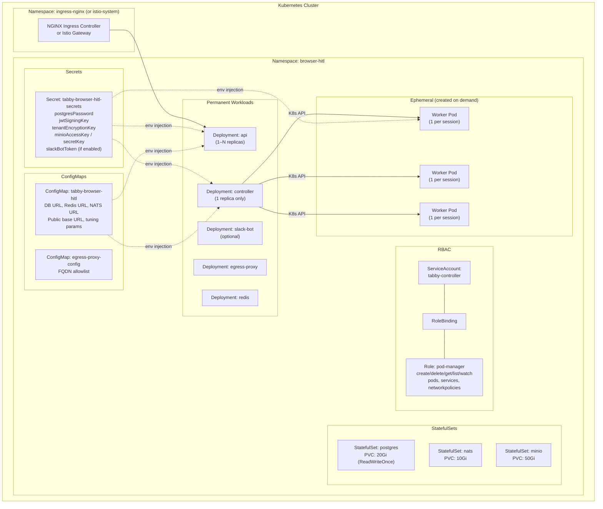
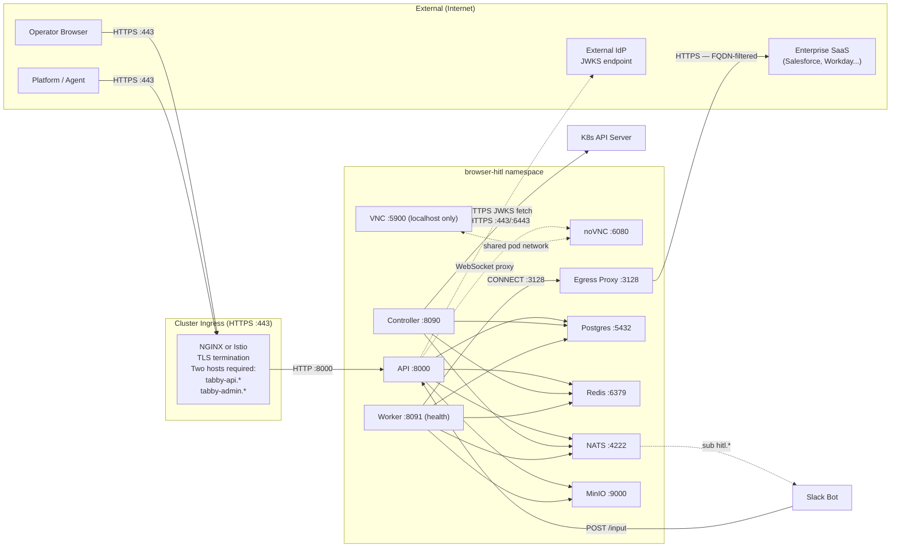
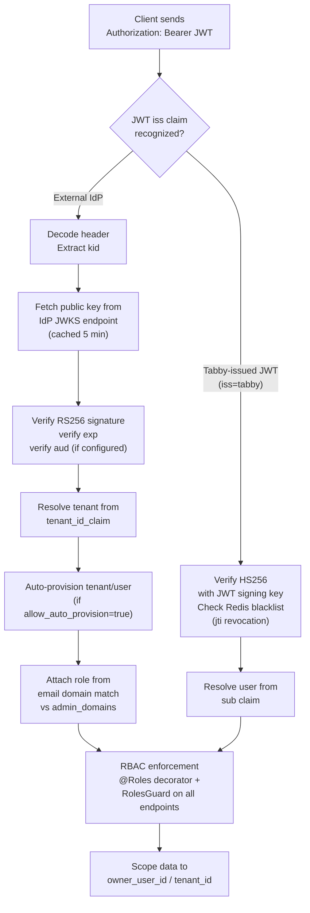

# Tabby (Browser HITL) — Architecture Reference

**Version:** 1.3.6  
**Audience:** Enterprise infosec review, infrastructure teams, security auditors  
**Last updated:** 2026-05-05

> **Note:** Section 11 at the end of this document covers planned improvements and future roadmap.

---

## 1. System Overview

Tabby is a Kubernetes-native platform that maintains persistent authenticated browser sessions on behalf of AI agents and automation platforms. Each session runs a dedicated Chromium instance in an ephemeral Kubernetes pod. When automation encounters a challenge it cannot defeat — MFA, CAPTCHA, device verification, or any custom human input — the system pauses, notifies a human operator via Slack or VNC Link on response, provides a live browser stream (VNC or CDP), and resumes once the challenge is resolved.

**Primary use case:** An AI agent or external platform calls `POST /credentials/request`. Tabby checks whether a live, healthy session exists for that application. If yes, it returns cached credentials (cookies, headers, tokens) immediately. If no live session exists, it orchestrates a fresh browser login, escalating to a human only when the automated login hits a wall it cannot pass.

**What Tabby is not:** It is not an identity provider. It does not issue OAuth tokens for users. It does not perform SAML or OIDC federation. It is a browser session manager that acts as an OAuth Resource Server — it validates JWTs issued by a third-party IdP (Frontegg, Okta, Azure AD, etc.) and scopes all data access to the authenticated tenant and user.

---

## 2. Component Diagram




> **Note:** Admin UI exists in the chart (`adminUi.enabled`) but is currently disabled. A full management UI is planned — see Section 11.

---

## 3. Data Flow Diagrams

### 3.1 Session Lifecycle




### 3.2 HITL Flow (Human Intervention)

HITL can be triggered and resolved through multiple channels: Slack bot, MCP (via VNC link in tool response), or direct VNC access. The notification channel is configurable — Slack is optional.




### 3.3 Credential Request Flow




### 3.4 OAuth / Multi-Tenant Auth Flow




---

## 4. Session State Machine




**Baton state machine** (concurrent with session state during HITL):




---

## 5. Deployment Topology




### Pod Lifecycle


| Pod Type                | Created By           | Lifetime                                                | Count                        |
| ----------------------- | -------------------- | ------------------------------------------------------- | ---------------------------- |
| API                     | Helm / Deployment    | Permanent                                               | 1–N (stateless, scalable)    |
| Controller              | Helm / Deployment    | Permanent                                               | **Always exactly 1**         |
| Admin UI                | Helm / Deployment    | **Currently disabled**                                  | 0 (planned — see Section 11) |
| Slack Bot               | Helm / Deployment    | Permanent, optional                                     | 0 or 1                       |
| Egress Proxy            | Helm / Deployment    | Permanent                                               | 1                            |
| Postgres / NATS / MinIO | Helm / StatefulSet   | Permanent                                               | 1 each                       |
| Redis                   | Helm / Deployment    | Permanent                                               | 1                            |
| Worker                  | Controller (dynamic) | Ephemeral — exists only for the duration of one session | 0 to N                       |


---

## 6. Network Diagram




### Port Reference


| Service            | Port | Protocol       | Exposed Externally?              | Notes                               |
| ------------------ | ---- | -------------- | -------------------------------- | ----------------------------------- |
| API                | 8000 | HTTP/WebSocket | Yes (via Ingress)                | REST API + VNC WebSocket proxy      |
| Admin UI           | 8000 | HTTP           | Yes (via Ingress, separate host) | Currently disabled — see Section 11 |
| Controller         | 8090 | HTTP           | No — in-cluster only             | Health check only                   |
| Worker (health)    | 8091 | HTTP           | No — in-cluster only             | Kubernetes liveness/readiness       |
| Worker (VNC)       | 5900 | VNC            | No — localhost only              | x11vnc, binds 127.0.0.1 only        |
| noVNC sidecar      | 6080 | HTTP/WebSocket | No — proxied via API             | WebSocket VNC client                |
| Egress Proxy       | 3128 | HTTP CONNECT   | No — in-cluster only             | Workers use as HTTP proxy           |
| Egress Proxy admin | 8095 | HTTP           | No — in-cluster only             | Allowlist management API            |
| Postgres           | 5432 | TCP            | No — in-cluster only             |                                     |
| Redis              | 6379 | TCP            | No — in-cluster only             |                                     |
| NATS               | 4222 | TCP            | No — in-cluster only             |                                     |
| NATS monitor       | 8222 | HTTP           | No — in-cluster only             | Debug endpoint                      |
| MinIO API          | 9000 | HTTP           | No — in-cluster only             | S3-compatible                       |
| MinIO console      | 9001 | HTTP           | No — in-cluster only             | Admin console (disable in prod)     |


---

## 7. Security Model

### 7.1 Authentication Chain




### 7.2 Data Encryption


| Data                                      | Encryption                                             | Key                                                   |
| ----------------------------------------- | ------------------------------------------------------ | ----------------------------------------------------- |
| Credentials and artifacts at rest (MinIO) | AES-256-GCM                                            | `TENANT_ENCRYPTION_KEY` — 32-byte key, per deployment |
| Passwords in DB                           | bcrypt cost 12                                         | N/A (one-way hash)                                    |
| NATS events                               | No payload encryption; subject names contain no PII    | TLS in transit (optional)                             |
| Postgres data at rest                     | Rely on disk/volume encryption at infrastructure layer | —                                                     |
| JWT signing                               | HS256                                                  | `JWT_SIGNING_KEY` — symmetric, ≥32 chars              |


**Critical:** `TENANT_ENCRYPTION_KEY` must be present on **both** API and Worker pods. If missing from either, credential extraction silently returns empty values.

### 7.3 Container Security

All containers run with:

- `runAsNonRoot: true`
- `allowPrivilegeEscalation: false`
- `capabilities.drop: [ALL]`


| Service                                                         | runAsUser (UID)                                    |
| --------------------------------------------------------------- | -------------------------------------------------- |
| API, Admin UI, Controller, Slack Bot, Egress Proxy, NATS, MinIO | 1000                                               |
| Postgres, Redis                                                 | 999                                                |
| Worker                                                          | `pwuser` (non-root, part of Playwright base image) |


No privileged containers. No host network access. No host PID.

### 7.4 Network Policies

When `networkPolicies.enabled: true`, Kubernetes NetworkPolicies enforce the following allowed traffic matrix:


| Source             | Destination              | Port     | Allowed?                          |
| ------------------ | ------------------------ | -------- | --------------------------------- |
| Ingress controller | API                      | 8000     | Yes                               |
| Ingress controller | Admin UI                 | 8000     | Yes                               |
| API                | Postgres                 | 5432     | Yes                               |
| API                | Redis                    | 6379     | Yes                               |
| API                | NATS                     | 4222     | Yes                               |
| API                | MinIO                    | 9000     | Yes                               |
| Controller         | Postgres                 | 5432     | Yes                               |
| Controller         | Redis                    | 6379     | Yes                               |
| Controller         | NATS                     | 4222     | Yes                               |
| Controller         | K8s API server           | 443/6443 | Yes                               |
| Slack Bot          | NATS                     | 4222     | Yes                               |
| Slack Bot          | API                      | 8000     | Yes                               |
| Worker             | Postgres                 | 5432     | Yes                               |
| Worker             | Redis                    | 6379     | Yes                               |
| Worker             | NATS                     | 4222     | Yes                               |
| Worker             | MinIO                    | 9000     | Yes                               |
| Worker             | Egress Proxy             | 3128     | Yes                               |
| Egress Proxy       | Internet (FQDN-filtered) | 443      | Configured allowlist              |
| API                | External IdP (JWKS)      | 443      | Yes (required for JWT validation) |
| Everything else    | Everything else          | Any      | **Denied**                        |


**Network policies are disabled by default** (`networkPolicies.enabled: false`). Enable in production.

### 7.5 RBAC


| Role         | Permissions                                                                              |
| ------------ | ---------------------------------------------------------------------------------------- |
| **Admin**    | Full access — all tenants, all sessions, IdP management, template management             |
| **Operator** | Own tenant only — sessions, HITL actions (takeover, release, input), credential requests |
| **Viewer**   | Own tenant, read-only — sessions list, session status, stream access                     |
| **Agent**    | Service-to-service — credential requests, session creation (no human-facing endpoints)   |


Role is resolved at login time from the JWT `email` claim domain vs. the `admin_domains` list on the IdP registration. No per-user configuration required.

### 7.6 Audit Trail

All write operations produce append-only audit events in PostgreSQL:

- SHA-256 hash chain — each event includes the hash of the previous event
- `pg_advisory_lock(42)` serializes chain writes
- Daily anchor records for integrity verification
- Retention: 30 days (configurable via `lifecycleInterventionRetentionDays`)

### 7.7 Rate Limiting and Account Lockout

- API rate limiting via `@nestjs/throttler`
- Password auth: 5 failed attempts → 15-minute lockout (`users.locked_until`)
- Login request coalescing: Redis distributed lock (one login per app/tenant, 5-min TTL) + PostgreSQL `SELECT ... FOR UPDATE` — prevents concurrent login storms that could lock target accounts
- Worker-level login rate: minimum 60-second gap between attempts

### 7.8 Secret Management

Secrets flow:

1. Operator sets values in `values-onprem.yaml` (never committed to git)
2. Helm renders them into a Kubernetes Secret (`tabby-browser-hitl-secrets`)
3. API and Controller pods mount the Secret as environment variables
4. Controller injects `TENANT_ENCRYPTION_KEY` into each worker pod it creates at runtime

Supported external secret managers: any operator that writes a Kubernetes Secret with the expected keys (e.g., External Secrets Operator, Vault Agent Injector, AWS Secrets Manager CSI driver).

---

## 8. Technology Stack

### Application


| Component    | Runtime | Version  | Language              |
| ------------ | ------- | -------- | --------------------- |
| Tabby API    | Node.js | 20 (LTS) | TypeScript            |
| Controller   | Node.js | 20 (LTS) | TypeScript            |
| Worker       | Node.js | 20 (LTS) | TypeScript            |
| Slack Bot    | Node.js | 20 (LTS) | TypeScript            |
| Admin UI     | Next.js | 15.1.6   | TypeScript / React 19 |
| Egress Proxy | Node.js | 20.18.1  | TypeScript            |


### Application Frameworks


| Package                 | Version  | Purpose                      |
| ----------------------- | -------- | ---------------------------- |
| NestJS                  | ^10.4.15 | API and Controller framework |
| Playwright              | 1.50.0   | Browser automation           |
| TypeORM                 | ^0.3.20  | Database ORM                 |
| @slack/bolt             | ^3.18.0  | Slack integration            |
| botbuilder              | ^4.23.3  | Teams Bot Framework          |
| passport-jwt            | ^4.0.1   | JWT auth                     |
| prom-client             | ^15.1.3  | Prometheus metrics           |
| @kubernetes/client-node | ^1.0.0   | K8s pod management           |


### Infrastructure (in-cluster defaults)


| Service        | Image                        | Version                      |
| -------------- | ---------------------------- | ---------------------------- |
| PostgreSQL     | postgres                     | 16.8-alpine                  |
| Redis          | redis                        | 7.4-alpine                   |
| NATS JetStream | nats                         | 2.10.24-alpine               |
| MinIO          | minio/minio                  | RELEASE.2025-03-12T18-04-18Z |
| noVNC          | python                       | 3.11-slim                    |
| Worker base    | mcr.microsoft.com/playwright | v1.58.2-noble                |
| Egress proxy   | node                         | 20.18.1-alpine               |


### Helm Chart


| Property                   | Value                                       |
| -------------------------- | ------------------------------------------- |
| Chart name                 | `browser-hitl`                              |
| Chart version              | `1.3.6`                                     |
| OCI registry               | `oci://ghcr.io/adoptai/charts/browser-hitl` |
| Application image registry | `ghcr.io/adoptai/tabby/{service}:{tag}`     |
| Templates                  | 26                                          |


### Kubernetes Requirements


| Requirement         | Value                                                                         |
| ------------------- | ----------------------------------------------------------------------------- |
| Minimum K8s version | 1.27                                                                          |
| Tested on           | 1.28 – 1.30                                                                   |
| Required APIs       | `apps/v1`, `networking.k8s.io/v1`, `rbac.authorization.k8s.io/v1`, `batch/v1` |
| StorageClass        | Required (ReadWriteOnce PVCs)                                                 |
| Ingress             | NGINX Ingress Controller **or** Istio + Gateway                               |


---

## 9. NATS Event Topology

### Streams


| Stream           | Subjects                                                | Purpose                                  |
| ---------------- | ------------------------------------------------------- | ---------------------------------------- |
| `HITL_EVENTS`    | `hitl.*.{tenantId}.{sessionId}`                         | HITL lifecycle events                    |
| `SESSION_EVENTS` | `session.state.changed.*.`*, `auth.bundle.exported.*.*` | Session state + credential export events |


### Subject Patterns


| Subject                                        | Publisher  | Subscribers   |
| ---------------------------------------------- | ---------- | ------------- |
| `hitl.started.{tenantId}.{sessionId}`          | Controller | Slack Bot     |
| `hitl.completed.{tenantId}.{sessionId}`        | Controller | Slack Bot     |
| `session.state.changed.{tenantId}.{sessionId}` | Controller | Internal only |
| `auth.bundle.exported.{tenantId}.{appId}`      | Worker     | Internal only |


**Durability:** `sync_interval: always` is mandatory. Removing it risks data loss on pod restart.

---

## 10. Database Schema Overview

```
tenants
  └── identity_providers (OIDC/SAML IdP registrations, JWKS config)
  └── users (email, role, failed_login_count, locked_until)
       └── user_identities (external IdP sub claims)
  └── agent_clients (OAuth 2.0 service accounts)
  └── applications (app config: DSL, export_policy, browser_policy)
       └── service_profiles (versioned credential profile: STAGING→CANARY→ACTIVE→RETIRED)
            └── sessions (state machine, baton_state, pending_input_request)
                 └── session_batons (baton ownership log)
                 └── interventions (HITL records, input_request_metadata)
                 └── artifact_bundles (pointer to MinIO, encryption metadata)
                      └── artifact_consumptions (access log)
  └── audit_events (hash-chained, append-only)
  └── audit_anchors (daily integrity records)
  └── app_templates (reusable DSL templates)
  └── login_queue (serializes concurrent login attempts)
```

**Migrations:** 17 TypeORM migrations, run automatically on API startup. `synchronize: false`. Rollback via `down()` methods.

**Row-Level Security:** All tenant-scoped tables enforce RLS. Operator/Viewer roles see only records matching their `owner_user_id`. Admin sees all records within their tenant.

---

## 11. Future Improvements

### Management UI

The Admin UI exists in the chart but is currently disabled. The immediate priority is building a full management interface for configuring applications, service profiles, credentials, and monitoring sessions without requiring direct API calls or database access.

### Worker Resource Optimization

Each worker pod currently runs a full Chromium instance (~800MB-1GB memory). For deployments with hundreds of service profiles, this adds up quickly. We are actively investigating:

- **Multi-session pods** — running multiple isolated browser contexts within a single Chromium process, sharing the base memory footprint across sessions
- **Lightweight browser alternatives** — evaluating lighter headless engines for sites that don't require full Chromium rendering
- **Session pooling** — reusing warm browser instances across sequential credential extractions instead of cold-starting per session

### Autonomous Site Exploration

Currently, adding a new website requires manually authoring a Login DSL script and mapping egress proxy domains. The goal is to automate both: Tabby explores the login flow, auto-generates the DSL, and discovers the required domains for the egress allowlist.

### Credential Injection API

Not all credentials come from browser automation. A `POST /credentials/inject` endpoint would allow agents or external systems (e.g., Chrome extensions, token managers) to push credentials into Tabby for centralized management and distribution.

