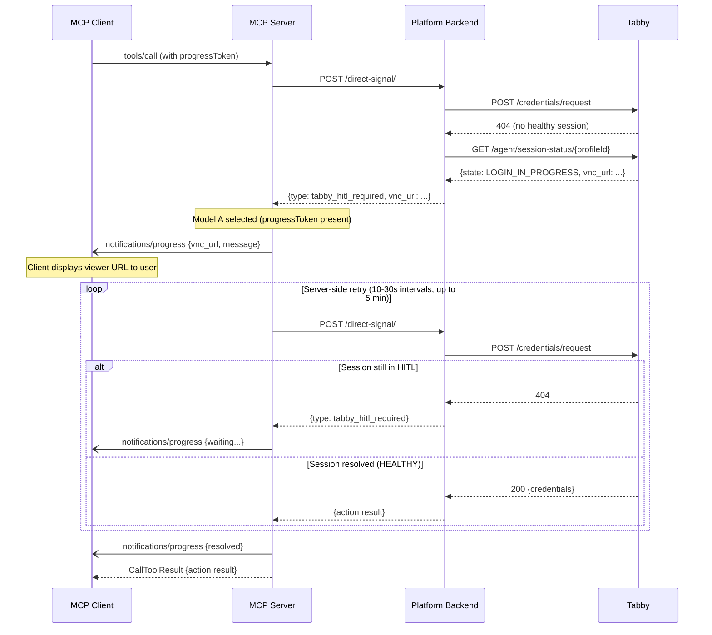
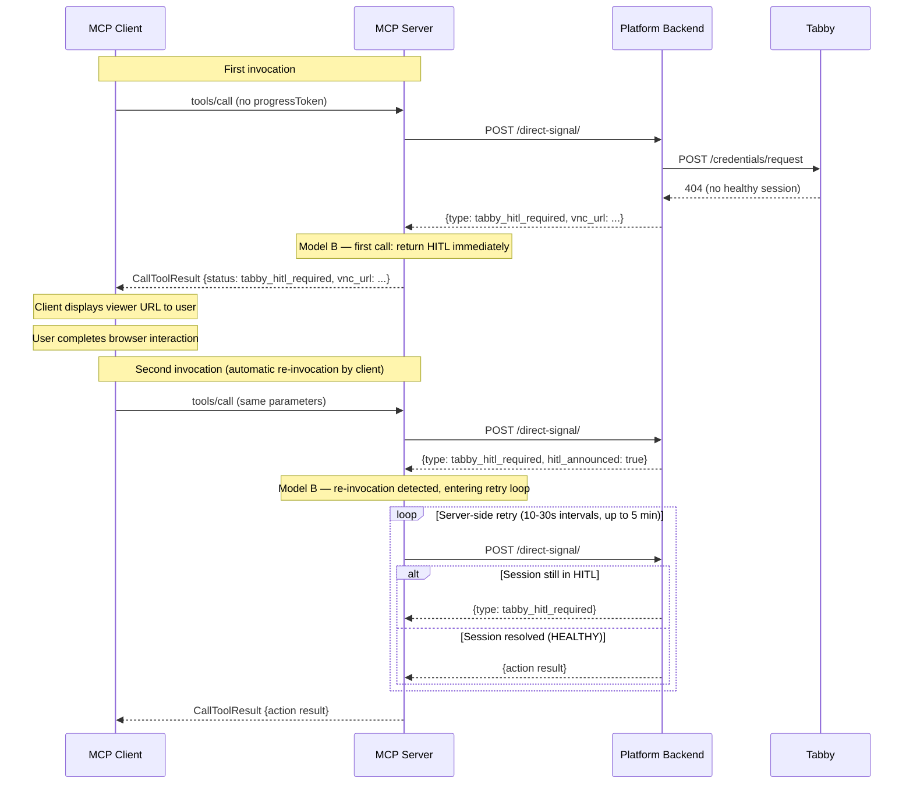

# Tabby Viewer — Technical Integration Guide

## Important Note

The improvements described in this document have been validated in our development environments but are **not yet deployed** to the Automation Anywhere environment. They are currently going through our release and deployment process.

This guide is intended for the Automation Anywhere engineering team to implement the required client-side behavior. Both server-side and client-side changes are needed for the intended experience.

---

## 1. HITL Response Structure

When an MCP tool execution requires human interaction in a browser, the tool result includes the following fields:

```json
{
  "status": "tabby_hitl_required",
  "session_id": "958fe57d-324e-4c14-9c7d-abb2633a25ad",
  "profile_id": "salesforce-aa",
  "state": "LOGIN_IN_PROGRESS",
  "message": "Log into Salesforce and complete any MFA/OTP verification.",
  "vnc_url": "https://viewer.example.com/vnc/958fe57d-...",
  "short_url": "https://viewer.example.com/s/abc123",
  "step_index": 1,
  "input_type": "confirm",
  "instructions": "...",
  "pending_input": {
    "step_index": 1,
    "input_type": "confirm",
    "label": "Log into Salesforce..."
  }
}
```


### Key Fields


| Field          | Type    | Description                                                                        |
| -------------- | ------- | ---------------------------------------------------------------------------------- |
| `status`       | string  | Always `"tabby_hitl_required"` when human interaction is needed.                   |
| `vnc_url`      | string  | The viewer URL the user must open.                                                 |
| `short_url`    | string  | Alternative short URL for the viewer.                                              |
| `session_id`   | string  | Identifies the browser session. Stable across invocations.                         |
| `step_index`   | integer | Identifies the current intervention step. Changes when a new intervention appears. |
| `message`      | string  | Human-readable description of the required action.                                 |
| `instructions` | string  | Guidance for the language model on how to handle the response.                     |


### Identifying HITL

To determine whether a tool result requires human interaction, check:

```
result.status == "tabby_hitl_required"
```

---


## 2. Model Selection — Progress Token Detection

The server automatically selects the interaction model based on whether the MCP client includes a progress token in the tool invocation request.

### MCP Progress Token

Per the [MCP specification](https://modelcontextprotocol.io/specification/draft/basic/utilities/progress), a client can include a `progressToken` in the `_meta` field of a tool call request to indicate that it wants to receive progress notifications during execution.

```json
{
  "jsonrpc": "2.0",
  "method": "tools/call",
  "params": {
    "name": "RAMP_QUOTE_QUOTELINE_CREATOR_AGENT",
    "arguments": { ... },
    "_meta": {
      "progressToken": "unique-token-123"
    }
  }
}
```


### Selection Logic

```
if progressToken is present and not null:
    → Model A (progress-based continuation)
else:
    → Model B (retry-based continuation)
```


### Critical Alignment Requirement


| Client sends progressToken | Client displays progress notifications | Result                                                  |
| -------------------------- | -------------------------------------- | ------------------------------------------------------- |
| Yes                        | Yes                                    | Model A works correctly                                 |
| Yes                        | No                                     | **Model A selected but user cannot see the viewer URL** |
| No                         | N/A                                    | Model B works correctly                                 |


If the MCP client sends a progress token but does not render progress notifications in the user interface, the server will select Model A and deliver the viewer URL through the progress channel. The user will not see the link. The execution will appear to hang.

**The client must ensure that its progress-token behavior matches its actual rendering capabilities.**

### References

- [MCP Specification — Progress](https://modelcontextprotocol.io/specification/draft/basic/utilities/progress)
- [MCP Specification — Tools](https://modelcontextprotocol.io/specification/draft/server/tools)

---


## 3. Model A — Technical Details


### Sequence




### Progress Notification Payload

During execution, the server sends progress notifications with the following structure in the `message` field (JSON-encoded):

**Initial HITL notification:**

```json
{
  "type": "tabby_hitl_required",
  "vnc_url": "https://viewer.example.com/vnc/...",
  "short_url": "https://viewer.example.com/s/abc123",
  "message": "Log into Salesforce and complete any MFA/OTP verification.",
  "step_index": 1
}
```

**Waiting notification (during retry):**

```json
{
  "type": "tabby_hitl_waiting",
  "attempt": 3,
  "message": "⏳ Waiting for human login — retrying automatically (4m20s remaining)"
}
```

**New intervention (if the required action changes):**

```json
{
  "type": "tabby_hitl_new_intervention",
  "vnc_url": "https://viewer.example.com/vnc/...",
  "short_url": "https://viewer.example.com/s/def456",
  "message": "Enter OTP code.",
  "step_index": 2
}
```

**Resolved:**

```json
{
  "type": "tabby_hitl_resolved",
  "message": "✅ Login resolved — executing action"
}
```


### Client Implementation Requirements for Model A

1. Register a progress notification handler for the tool call.
2. Parse the `message` field of progress notifications as JSON.
3. When `type` is `tabby_hitl_required` or `tabby_hitl_new_intervention`, extract `vnc_url` and present it to the user.
4. Open the viewer URL in a standard browser tab/window (see Section 5).
5. Continue waiting for the tool call to complete — do not cancel or re-invoke.
6. Handle timeout: if the tool call takes longer than the server deadline (default 5 minutes), it will return the last HITL state as the tool result.


### References

- [MCP Specification — Progress Notifications](https://modelcontextprotocol.io/specification/draft/basic/utilities/progress)
- [MCP Specification — Streamable HTTP Transport](https://modelcontextprotocol.io/specification/draft/basic/transports) — Server can send notifications before the final response over SSE.

---


## 4. Model B — Technical Details


### Sequence




### Re-invocation Detection

On the first HITL response, the platform sets a short-lived marker (TTL 300 seconds) using the session identifier. When the same tool is invoked again for the same session, the platform detects that the HITL was already announced and includes `hitl_announced: true` in the response. The server then enters the retry loop instead of returning the HITL again.

### Client Implementation Requirements for Model B

1. Identify the HITL response by checking `status == "tabby_hitl_required"`.
2. Extract `vnc_url` (or `short_url`) from the result.
3. Present the viewer link to the user and open it in a standard browser tab/window (see Section 5).
4. After the user completes the interaction, **re-invoke the same MCP tool with the same parameters**.
5. The re-invocation enters the server-side retry loop. Wait for it to return the final result.
6. Do not retry more than once. The server handles further retries internally.
7. Handle timeout: if the retry loop exceeds the deadline, the tool returns the last HITL state. Present guidance to the user.


### Detecting When to Re-invoke

The client should re-invoke after the user has had a reasonable opportunity to complete the browser interaction. Implementation options:

- Re-invoke immediately after the first call returns and let the server-side retry loop wait for resolution.
- Wait for a user signal (for example, the user closes the viewer tab or indicates completion) and then re-invoke.
- Re-invoke after a fixed delay.

The server-side retry loop handles the timing internally, so the re-invocation can happen at any point after the first call.

### References

- [MCP Specification — Tools](https://modelcontextprotocol.io/specification/draft/server/tools)

---


## 5. Browser Opening Requirements

Both models require the MCP client to open the viewer URL in a browser. The requirements are the same regardless of the model.

### Functional Requirement

The viewer URL must be opened as a user-visible browser tab or window in a standard browsing context. The opened context must:

- Support cookies and session storage.
- Support HTTP redirects (including cross-origin redirects for identity-provider flows).
- Allow JavaScript execution.
- Not be restricted by iframe sandboxing, webview limitations, or non-standard browser surfaces.


### Automatic Close Compatibility

For the viewer to close automatically after the interaction completes:

- The browser tab/window must have been opened through a programmatic mechanism (for example, the host application's browser-opening API, or `window.open()` in a browser-based client).
- If the tab was opened by direct user action (copy-paste, manual navigation), the viewer page cannot close itself. The user must close it manually.


### Popup Blocker Considerations

If the host application opens the URL programmatically, the browser may block it as a popup. The client should:

- Open the URL as close to a user interaction as possible (for example, in response to a user click or action).
- If the popup is blocked, present the URL as a visible, clickable link so the user can open it manually.


### References

- [MDN —](https://developer.mozilla.org/en-US/docs/Web/API/Window/open) `window.open()`
- [MDN —](https://developer.mozilla.org/en-US/docs/Web/API/Window/close) `window.close()`
- [MDN — User Activation](https://developer.mozilla.org/en-US/docs/Web/Security/Defenses/User_activation)
- [OAuth 2.0 Security BCP (RFC 9700), Section 11](https://datatracker.ietf.org/doc/html/rfc9700#section-11) — Embedded user agents and OAuth.

---


## 6. Configuration

The server supports the following configuration options (managed on the Adopt deployment side):


| Variable                        | Default             | Description                                                                                                                                      |
| ------------------------------- | ------------------- | ------------------------------------------------------------------------------------------------------------------------------------------------ |
| `ENABLE_SERVER_RETRY`           | `true`              | Enables the server-side retry system. Set to `false` to fall back to the previous behavior (LLM-instruction-based retry).                        |
| `FORCE_HITL_MODEL`              | unset (auto-detect) | Forces Model `A` or `B` regardless of progress-token detection. Useful when the client sends a progress token but does not render notifications. |
| `DIRECT_SIGNAL_TIMEOUT_SECONDS` | `600`               | Maximum duration (in seconds) for the server-side retry loop.                                                                                    |


These are not configurable by the MCP client. They are set in the server deployment environment.

---


## 8. Decision Table


| Client sends progress token | Client displays progress to user | Recommended configuration | Expected behavior                                       |
| --------------------------- | -------------------------------- | ------------------------- | ------------------------------------------------------- |
| Yes                         | Yes                              | Auto-detect (default)     | Model A — single execution, viewer link via progress    |
| Yes                         | No                               | Set `FORCE_HITL_MODEL=B`  | Model B — prevents invisible viewer link                |
| No                          | N/A                              | Auto-detect (default)     | Model B — viewer link in tool result, client re-invokes |


---


## 9. Validated Test Results

The following scenarios have been validated in our testing environment:


| Scenario                                                                         | Result                     |
| -------------------------------------------------------------------------------- | -------------------------- |
| Model B — First call returns viewer URL immediately                              | ✅ Verified                 |
| Model B — Re-invocation enters server-side retry loop                            | ✅ Verified                 |
| Model B — Retry loop detects session resolution and returns action result        | ✅ Verified (multiple runs) |
| Model A — Progress notification delivers viewer URL during execution             | ✅ Verified (MCP Inspector) |
| Model A — Retry loop runs within the same tool call                              | ✅ Verified                 |
| Automatic close — Viewer tab closes after session resolution (programmatic open) | ✅ Verified                 |
| Timeout — Retry loop stops after deadline and returns last HITL state            | ✅ Verified                 |
| New intervention — Step index change detected and new notification sent          | ✅ Verified                 |


These results were obtained in a local development environment. Production behavior should be validated after deployment.