# Tabby Viewer — User Flow Overview

## Important Note

The improvements described in this document have been validated in our development environments but are **not yet deployed** to the Automation Anywhere environment. They are currently going through our release and deployment process.

We are sharing this documentation now so that Automation Anywhere can evaluate and implement the required client-side behavior in parallel. The expected experience requires both server-side updates (on our side) and client-side integration updates (on the Automation Anywhere side). Deploying only the server-side changes would not deliver the intended experience.

---

## What This Document Covers

When an MCP tool requires human interaction in a browser (for example, logging into a third-party application like Salesforce), the Tabby integration provides a browser viewer where the user completes the required action. This document describes:

1. How the browser viewer should be opened.
2. How automatic closing works after the user finishes.
3. The two supported interaction models and how the MCP client selects one.
4. What the MCP client must implement for each model.

---

## 1. Opening the Browser Viewer

When human interaction is required, the MCP server returns a viewer URL. The MCP client must open this URL in a **full browser tab or browser window**.

### Requirements

- The URL must be opened in a standard browser context — a normal browser tab or a separate browser window.
- A smaller browser window (for example, 1100×750 pixels) is acceptable.
- The browser context must support standard web navigation, cookies, redirects, and authentication flows.
- The viewer must **not** be embedded in a restricted iframe, sandboxed webview, or non-standard browser surface that does not behave as a normal browser page.

### Why This Matters

The viewer URL leads through an authentication flow that involves redirects, cookies, and identity-provider interactions. These require a standard browser environment. Restricted or embedded surfaces may block authentication, prevent cookie storage, or interfere with the identity-provider flow, causing the viewer to fail or display errors.

### References

- [MDN —](https://developer.mozilla.org/en-US/docs/Web/API/Window/open) `window.open()` — Standard browser mechanism for opening new windows or tabs.
- [OAuth 2.0 Security Best Current Practice (RFC 9700), Section 11](https://datatracker.ietf.org/doc/html/rfc9700#section-11) — Recommendations against using embedded user agents for OAuth flows.

---

## 2. Automatic Closing

When the user finishes the required interaction and the session resolves, the viewer page can close its own browser tab automatically — **but only under specific conditions.**

### How It Works

Browsers restrict scripts from closing tabs or windows that were not opened programmatically. Specifically:

- A tab opened using a programmatic mechanism (conceptually, `window.open()`) **can** close itself when the interaction completes.
- A tab opened by the user manually (copying a link, typing a URL, or using browser UI) **cannot** be closed by the page's own script.

This means:

> **For automatic close to work, the MCP client must open the viewer URL using a programmatic browser-open mechanism.**

### Expected Behavior

When the viewer tab is opened programmatically and the user completes the required interaction, the viewer can detect that the session resolved and close the tab automatically. This requires the tab to have been opened through a compatible programmatic mechanism.

### References

- [MDN —](https://developer.mozilla.org/en-US/docs/Web/API/Window/close) `window.close()` — Browser restrictions on script-closing windows.
- [MDN — User Activation](https://developer.mozilla.org/en-US/docs/Web/Security/Defenses/User_activation) — How browsers gate programmatic actions on user interaction.
- [textslashplain —](https://textslashplain.com/2021/02/04/window-close-restrictions/) `window.close` [Restrictions](https://textslashplain.com/2021/02/04/window-close-restrictions/) — Detailed explanation of browser close behavior by a Chromium engineer.

---

## 3. Interaction Models

> To view the diagram below with full styling, paste the Mermaid code block into [mermaid.live](https://mermaid.live).

```mermaid
graph TB
    subgraph MODEL_A["MODEL A — MCP Client sends progressToken"]
        direction LR
        subgraph A_CLIENT["MCP Client"]
            A_C1["• Read progress notifications"]
            A_C2["• Surface them to the end user"]
        end
        subgraph A_SERVER["MCP Server"]
            A_S1["• Receives progressToken"]
            A_S2["• Sends VNC link via progress"]
            A_S3["• Retries automatically until resolved"]
        end
        A_CLIENT -- "Send progressToken" --> A_SERVER
        A_SERVER -- "Progress notifications with VNC URL + status" --> A_CLIENT
    end

    subgraph MODEL_B["MODEL B — MCP Client does not send progressToken"]
        direction LR
        subgraph B_CLIENT["MCP Client"]
            B_C1["• Read tool result and instructions"]
            B_C2["• Re-invoke the tool one time"]
        end
        subgraph B_SERVER["MCP Server"]
            B_S1["• First call returns VNC Link"]
            B_S2["• Second call enters server-side retry"]
            B_S3["• Waits for login, resumes automatically"]
        end
        B_CLIENT -- "First tool call" --> B_SERVER
        B_SERVER -- "VNC Link" --> B_CLIENT
        B_CLIENT -- "Second tool call — server retries automatically" --> B_SERVER
    end

    CONFIG["Configuration: FORCE_HITL_MODEL = A or B | ENABLE_SERVER_RETRY = true or false"]

    style MODEL_A fill:#a5d8ff,stroke:#1e1e1e
    style MODEL_B fill:#a5d8ff,stroke:#1e1e1e
    style A_CLIENT fill:#ffec99,stroke:#1e1e1e
    style A_SERVER fill:#ffec99,stroke:#1e1e1e
    style B_CLIENT fill:#ffec99,stroke:#1e1e1e
    style B_SERVER fill:#ffec99,stroke:#1e1e1e
    style CONFIG fill:#fff,stroke:#1e1e1e
```

The integration supports two interaction models. The MCP server automatically selects the appropriate model based on the MCP client's capabilities.

### Model A — Progress-Based Continuation

**User experience:**

1. The user invokes an MCP tool that requires browser interaction.
2. While the tool is executing, the MCP client receives a progress notification containing the viewer URL.
3. The MCP client surfaces the viewer link to the user (or opens it automatically).
4. The user opens the viewer and completes the required action.
5. The same tool execution continues monitoring the session.
6. When the session resolves, the tool returns the final result.
7. The user does not need to take any additional action — the flow completes in one logical operation.

**Key requirement:** The MCP client must receive and display progress notifications during tool execution. If the client requests progress notifications but does not display them, the user will not see the viewer link.

### Model B — Retry-Based Continuation

**User experience:**

1. The user invokes an MCP tool that requires browser interaction.
2. The tool returns immediately with the viewer URL and a message explaining that human interaction is required.
3. The MCP client presents the viewer link to the user.
4. The user opens the viewer and completes the required action.
5. The MCP client in parallel re-invokes the same tool with the same parameters.
6. On re-invocation, the server detects that the interaction was already announced and enters a server-controlled retry loop.
7. The retry loop monitors the session and returns the final result when the session resolves.
8. The user does not need to invoke the tool again — the re-invocation is handled by the client.

**Key requirement:** The MCP client must be capable of automatically re-invoking the tool after the user completes the browser interaction.

### How the Model Is Selected

The server selects the model automatically:

| Client behavior                                      | Selected model |
| ---------------------------------------------------- | -------------- |
| Client includes a progress token in the tool request | Model A        |
| Client does not include a progress token             | Model B        |

**Important:** If the MCP client includes a progress token but does not display progress notifications to the user, the server will select Model A and deliver the viewer URL through the progress channel. If the client discards or does not render these notifications, the user will not see the viewer link, and the experience will appear stuck.

The MCP client must ensure consistency between its declared capabilities and its actual behavior.

### Fallback and Override

The model selection can be overridden on the server side through environment configuration:

- **`FORCE_HITL_MODEL=B`** — forces Model B regardless of whether the client sends a progress token. This is useful when the client sends the token but does not actually render progress notifications.
- **`FORCE_HITL_MODEL=A`** — forces Model A regardless of client behavior.
- **`ENABLE_SERVER_RETRY=false`** — disables the server-side retry system entirely and falls back to the previous behavior, where retry is handled through LLM instructions only. This is the behavior that was already in place and working before these improvements.

These overrides allow the deployment team to adjust behavior without code changes if a specific client integration does not work as expected.

---

## 4. User Experience Comparison

| Aspect                               | Model A                                    | Model B                                    |
| ------------------------------------ | ------------------------------------------ | ------------------------------------------ |
| Number of tool invocations           | One                                        | Two (initial + automatic re-invocation)    |
| How the viewer link reaches the user | Via progress notification during execution | In the tool result of the first invocation |
| Server-side retry                    | Runs within the same tool execution        | Runs within the re-invocation              |
| User action required after login     | None                                       | None (client handles re-invocation)        |
| Client requirement                   | Display progress notifications             | Automatically re-invoke the tool           |

Both models can provide a seamless user experience. The quality of the experience depends on how well the MCP client implements the required behavior for the selected model.

---

