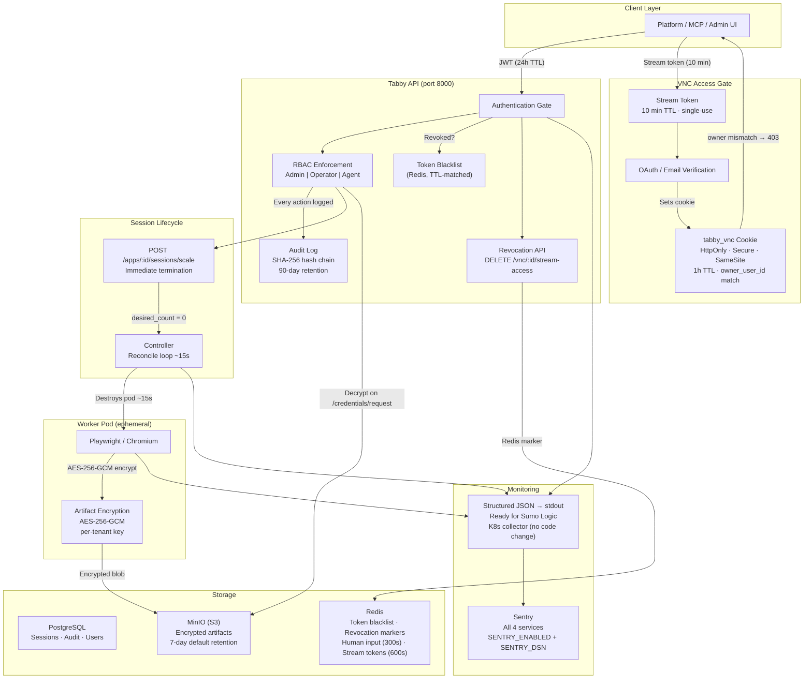

# Tabby Security Architecture — Infosec Overview

## Secrets & Keys Reference

| Secret | Purpose | Where Used | Rotation |
| --- | --- | --- | --- |
| `TENANT_ENCRYPTION_KEY` | AES-256-GCM key for artifact encryption/decryption | Worker (encrypt) + API (decrypt) | Single deployment-wide key, must match on both pods |
| `JWT_SIGNING_KEY` | Signs all Tabby-issued JWTs (login, service auth, VNC cookies) | API | Shared across API replicas |
| `AGENT_SECRET_HMAC_KEY` | HMAC for agent client_secret generation | API | Change invalidates all agent credentials |
| `SENTRY_DSN` | Sentry error reporting endpoint | All services | Non-sensitive, can be rotated freely |

## Token TTLs

| Token | TTL | Single-use? | Revocable? |
| --- | --- | --- | --- |
| User JWT | 24h | No | Yes (Redis blacklist) |
| VNC cookie (`tabby_vnc`) | 1h | No | Yes (session termination) |
| Stream token | 10 min | Yes | Yes (DELETE endpoint) |
| Short link (Redis) | 10 min | No | Yes (session termination) |
| Human input (Redis) | 300s | No | N/A (expires naturally) |
| OAuth state (Redis) | 5 min | Yes (GETDEL) | N/A |

## Data Retention

| Data | Default Retention | Env Var | Cleanup Schedule |
| --- | --- | --- | --- |
| Artifacts | 7 days | `LIFECYCLE_ARTIFACT_RETENTION_DAYS` | Daily 3:15 AM |
| Sessions (terminated) | 14 days | `LIFECYCLE_SESSION_RETENTION_DAYS` | Daily 3:15 AM |
| Interventions | 30 days | `LIFECYCLE_INTERVENTION_RETENTION_DAYS` | Daily 3:15 AM |
| Apps (zero sessions) | 30 days | `LIFECYCLE_APP_RETENTION_DAYS` | Daily 3:15 AM |
| Audit events | 90 days | Hardcoded (per-tenant planned) | Daily 2:00 AM |
