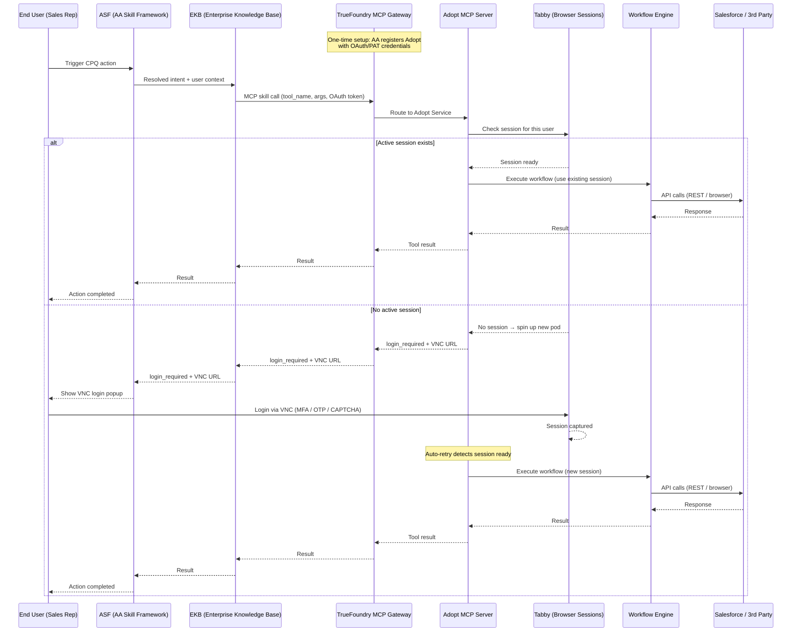
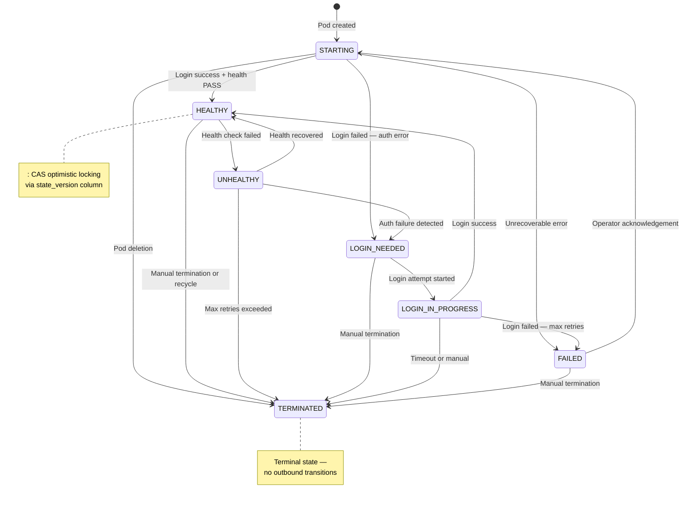
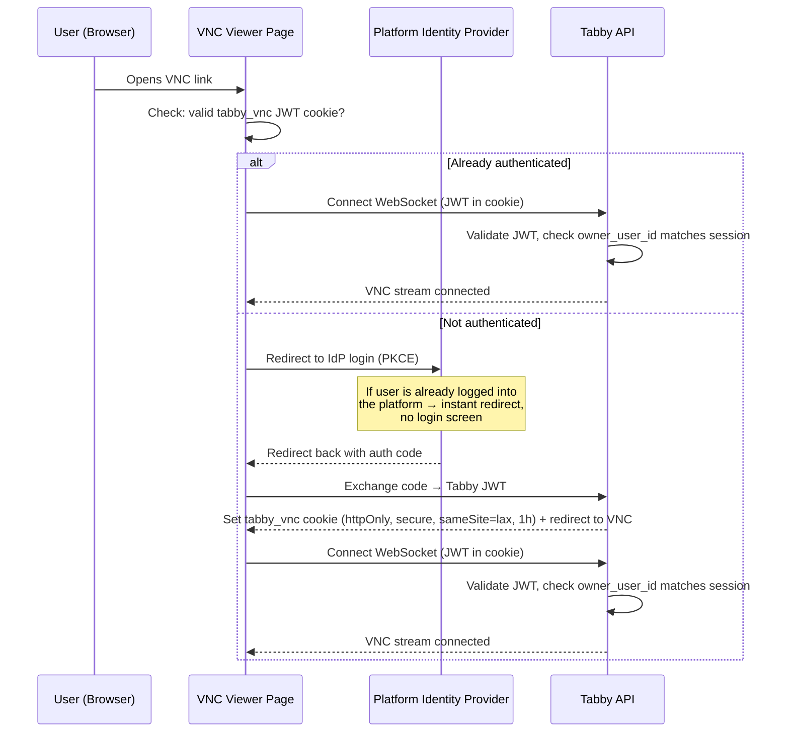

# Tabby — Session Security & Architecture

## Table of Contents

1. [Integration Flow](#integration-flow)
2. [Authentication & Token Handling](#authentication--token-handling)
3. [Role-Based Access Control (RBAC)](#role-based-access-control-rbac)
4. [Session Lifecycle & State Machine](#session-lifecycle--state-machine)
5. [Session Timeouts & TTLs](#session-timeouts--ttls)
6. [VNC Access — User Authentication](#vnc-access--user-authentication)
7. [Session Isolation](#session-isolation)
8. [Encryption & Credential Protection](#encryption--credential-protection)
9. [Network Security](#network-security)
10. [Security Controls Summary](#security-controls-summary)

---

## Integration Flow

---

## Authentication & Token Handling

Tabby supports multiple authentication paths. All tokens are JWTs signed with a server-side secret, carry a unique `jti` claim for revocation, and are validated on every request.

### Human Login

`POST /login` with email and password. Passwords are hashed with **bcrypt cost 12**. Account lockout activates after **5 failed attempts within 15 minutes**. Password complexity is enforced (12+ characters, uppercase, lowercase, digit, special character). Rate-limited to **5 requests/minute**.

### Service Token (Machine-to-Machine)

`POST /auth/service-token` with `client_id`, `client_secret`, and `tenant_id`. Credentials are validated against environment variables using **constant-time comparison** — no database lookup. Rate-limited to **20 requests/minute**. Default TTL: **1 hour**.

### Agent Token (OAuth 2.0 Client Credentials)

`POST /auth/agent-token` with `client_id`, `client_secret`, and `grant_type: "client_credentials"`. Agent clients are registered in the database by an Admin. Secrets are hashed with **HMAC-SHA256** (not bcrypt — machine secrets are high-entropy). Tokens are scoped to `allowed_profiles` — the agent can only request credentials for profiles explicitly listed. Rate-limited to **60 requests/minute**. Token includes `refresh_before` hint for proactive renewal.

### Token Exchange (Federation)

`POST /auth/token-exchange` supports two modes per RFC 8693:

- **`oidc_jwt`** — exchanges an external IdP JWT (e.g., Frontegg, Auth0, Okta, Azure AD) for a Tabby JWT. The external JWT is verified against the IdP's JWKS endpoint (fetched via OIDC discovery, cached 5 minutes). Supported algorithms: RS256, RS384, RS512, ES256, ES384, ES512. HS256 is explicitly rejected for external IdPs.
- **`agent_assertion`** — an agent bot exchanges its JWT on behalf of a specific user. Requires a valid agent JWT in the `Authorization` header and a `target_user_id` in the body. The resulting Tabby JWT is scoped to that user.

### Browser OAuth (Admin UI)

`GET /auth/oauth/:idpId/login` initiates a browser OAuth flow with **PKCE** (S256 challenge). OAuth state (code verifier, IdP ID, redirect URI) is stored in **Redis with a 5-minute TTL** — not in-memory, so it works across multiple API instances. The callback exchanges the authorization code for tokens, auto-provisions the user if `allow_auto_provision` is set on the IdP, and issues a Tabby JWT.

### Token Revocation

All JWTs carry a `jti` (JWT ID) claim. On logout or forced revocation, the `jti` is added to a **Redis blacklist** with a TTL matching the token's remaining lifetime. Every request checks the blacklist before accepting the token.

### Token Types Summary

| Token Type | Issued By | TTL | Scope | User-Level | Revocable | Description |
|------------|-----------|-----|-------|------------|-----------|-------------|
| Human JWT | `POST /login` | 24 hours | Full access per role | Yes — bound to a specific human user's email and role | Yes (jti blacklist) | Issued when an admin or operator logs in via email/password. Carries `sub` (user ID), `tenant_id`, and `role`. Used for all dashboard and API operations. |
| Service JWT | `POST /auth/service-token` | 1 hour (configurable) | Tenant-scoped | Service identity — authenticated as an internal system component, not an end user | Yes | Issued to internal platform services (Slack bot, Teams bot) via dedicated `client_id`/`client_secret` credentials stored in Kubernetes Secrets. Each service authenticates independently with its own short-lived token. Credentials are validated using constant-time comparison and are never exposed to end users. Rate-limited to 20 req/min. |
| Agent JWT | `POST /auth/agent-token` | 1 hour (configurable) | Allowed profiles only | No — machine identity, but can act on behalf of a user via token exchange | Yes | Issued to registered AI agent clients via OAuth 2.0 Client Credentials. The JWT carries `allowed_profiles[]` restricting which service profiles the agent can request credentials for. |
| Federated JWT | `POST /auth/token-exchange` | 5 min – 1 hour (requested) | User-scoped | Yes — bound to `owner_user_id` derived from the external IdP JWT's `sub` or configured `user_id_claim` | Yes | Issued when exchanging an external OIDC JWT (e.g., from Frontegg, Okta, Azure AD) or an agent assertion for a Tabby-native token. The resulting JWT is scoped to a specific end user — all sessions and credentials created with it are owned by that user. |
| VNC Access JWT | OAuth callback / email verify | 1 hour | Single session | Yes — contains `owner_user_id` matching the session owner, verified before granting VNC access | Yes | Stored as an httpOnly `tabby_vnc` cookie after the user authenticates via OAuth redirect or email verification. Used exclusively for VNC viewer access — validated on every WebSocket connection to ensure the viewer is the session owner. |
| Stream Token | `POST /sessions/:id/stream` | 10 minutes | Single session, read-only | No — bearer token, anyone with the URL can access during the TTL window | No (short-lived) | Short-lived signed token embedded in VNC URLs shared via Slack/Teams/MCP. Grants read-only access to a specific session's VNC stream. Intentionally not revocable — the 10-minute TTL limits exposure. After expiry, the VNC auth gate (OAuth or email) takes over. |

---

## Role-Based Access Control (RBAC)

Four roles are enforced across all 13 API controllers via decorator-based guards. Role assignment happens at the database query level — not application logic — so cross-user data access is not possible.

| Role | Permissions |
|------|-------------|
| **Admin** | Full access. Manage tenants, users, IdPs, agent clients, app templates. See all sessions across all users. |
| **Operator** | Create and manage apps, profiles, sessions. View and interact with HITL interventions. Scoped to own `owner_user_id`. |
| **Viewer** | Read-only access to own sessions and credentials. Cannot create or modify resources. |
| **Agent** | Machine-to-machine only. Request credentials for `allowed_profiles`. Cannot access admin endpoints. |

Role assignment methods:
- **Admin bootstrap:** first user on startup via `ADMIN_BOOTSTRAP_EMAIL` environment variable.
- **IdP-based:** emails matching `admin_domains` on IdP config receive Admin role; all others receive the IdP's `default_role`.
- **Manual:** Admin can assign roles via the user management API.

---

## Session Lifecycle & State Machine

Every browser session progresses through a deterministic seven-state machine. Transitions follow a strict allowlist — no shortcuts are possible (e.g., `HEALTHY` cannot jump directly to `LOGIN_NEEDED`).

| State | Meaning | Transitions to |
|-------|---------|----------------|
| **STARTING** | Pod created, browser launching, login DSL executing | HEALTHY, LOGIN_NEEDED, FAILED, TERMINATED |
| **HEALTHY** | Authenticated, credentials fresh, keepalive active | UNHEALTHY, TERMINATED |
| **UNHEALTHY** | Health check failed, 2-min escalation delay | HEALTHY, LOGIN_NEEDED, TERMINATED |
| **LOGIN_NEEDED** | Re-authentication required, login queued | LOGIN_IN_PROGRESS, TERMINATED |
| **LOGIN_IN_PROGRESS** | Login DSL executing, HITL may be active (10-min timeout) | HEALTHY, FAILED, TERMINATED |
| **FAILED** | Unrecoverable error, requires operator acknowledgement | STARTING, TERMINATED |
| **TERMINATED** | Final state, pod deleted | *(none)* |

**Controller as sole writer:** The Controller is the exclusive writer of session state. Transitions use CAS (Compare-And-Swap) optimistic locking via a `state_version` column. If zero rows match, a concurrent modification occurred and the Controller retries with fresh data.

**Baton system for HITL:** When human intervention is needed (MFA, CAPTCHA, device verification), browser ownership transfers via a four-state baton:

`AUTOMATION_CONTROL → HUMAN_REQUESTED → HUMAN_CONTROL → HUMAN_RELEASED → AUTOMATION_CONTROL`

If no human accepts within 10 minutes, the baton reverts automatically and the session transitions toward failure.

### Retry Matrix and Circuit Breakers

| Scenario | Max Attempts | Backoff |
|----------|-------------|---------|
| STARTING fails | 3 | Exponential (30s base, 2x, 30-min cap) |
| UNHEALTHY (transient) | 3 | Exponential |
| UNHEALTHY (auth fail) | 1 | None — straight to LOGIN_NEEDED |
| LOGIN_IN_PROGRESS fails | 3 | Exponential |
| FAILED | 0 | Requires operator acknowledgement |

**Circuit breakers** prevent cascading failures:
- **Per-app:** 5 failures in 15 min → pause that app
- **Per-tenant:** 15 failures in 15 min → pause that tenant
- **HITL fatigue:** 3 consecutive HITL failures → 30-min cooldown

---

## Session Timeouts & TTLs

All timeouts are consolidated here for reference:

| Resource | Timeout / TTL | User-Level | Description |
|----------|--------------|------------|-------------|
| Human JWT | 24 hours | Yes — per user | JWT issued on `POST /login` for admins/operators. Carries the user's ID, tenant, and role. Revocable via jti blacklist on logout. |
| Service/Agent JWT | 1 hour (configurable via `SERVICE_AUTH_TOKEN_TTL_SECONDS`) | Service identity — authenticated as internal system components or registered AI agents, not end users | JWT issued to internal platform services and registered AI agent clients for programmatic API access. Each service authenticates independently with dedicated credentials stored in Kubernetes Secrets. Service tokens are tenant-scoped; agent tokens are further restricted to `allowed_profiles`. Both are short-lived (1h default), revocable via jti blacklist, and rate-limited. |
| Federated JWT | 5 min – 1 hour (caller-requested, clamped) | Yes — per user | JWT issued via `POST /auth/token-exchange` when exchanging an external IdP token. Bound to a specific `owner_user_id` — all sessions and credentials created under this token belong to that user. |
| VNC access cookie (`tabby_vnc`) | 1 hour | Yes — per user per session | httpOnly JWT cookie set after OAuth redirect or email verification. Contains `owner_user_id` — validated on every VNC WebSocket connection to ensure only the session owner can view the browser stream. |
| Stream token | 10 minutes | No — bearer token | Short-lived signed JWT embedded in VNC URLs shared via Slack, Teams, or MCP. Grants access to a single session's VNC stream. Anyone with the URL can access it during the TTL window; after expiry, the OAuth/email auth gate takes over. |
| OAuth PKCE state | 5 minutes (Redis TTL) | No — ephemeral flow state | Stores the PKCE code verifier, IdP ID, and redirect URI during an OAuth authorization code flow. Stored in Redis (not in-memory) so it works across multiple API instances. Consumed once on callback. |
| OTP relay | 60 seconds (Redis TTL) | Yes — per session | One-time password submitted by a human operator via Slack/Teams, stored in Redis at `otp:{sessionId}`. The worker pod polls this key and fills the MFA field in the browser. Single-use — consumed on read. |
| Human input relay | 300 seconds (Redis TTL) | Yes — per session | Generic human input (password, CAPTCHA solution, verification code, URL) submitted via `POST /sessions/:id/input`. Stored in Redis at `human_input:{sessionId}:{stepIndex}`. Worker polls and consumes it to continue the login DSL. |
| Short-link redirect | 600 seconds (Redis TTL) | No — public redirect | Compact VNC URL created by `stream-token.service.ts` for MCP integrations. Maps a short code to the full noVNC viewer URL. Anyone with the link is redirected; authentication happens at the viewer level (OAuth/email gate). |
| HITL baton timeout | 10 minutes | Yes — per session | Maximum time a session waits in `HUMAN_REQUESTED` state for a human to accept VNC control. If no human takes over, the baton reverts to `AUTOMATION_CONTROL` and the session transitions toward failure. Prevents indefinite blocking. |
| Login DSL timeout | 10 minutes | Yes — per session | Maximum duration for a single login attempt (DSL execution in `LOGIN_IN_PROGRESS` state). If the login script hasn't completed by then (e.g., waiting for OTP that never arrives), the session transitions to `FAILED`. |
| Health check escalation delay | 2 minutes | Yes — per session | Grace period after a health check fails before the controller escalates from `UNHEALTHY`. Prevents transient network blips from triggering unnecessary re-logins. If health recovers within 2 minutes, the session returns to `HEALTHY`. |
| Keepalive interval | Configurable (default 3600s) | Yes — per application | How often the worker pod runs health checks (DOM checks, URL checks, status checks) and re-extracts credentials from the live browser. Configured per application in `keepalive_config.interval_seconds`. |
| Credential refresh | Configurable (`refresh_interval_seconds`, default 3600s) | Yes — per application | How often credentials (cookies, headers, CSRF tokens) are re-extracted from the browser and re-encrypted into a fresh artifact bundle. For volatile tokens (e.g., Salesforce aura), should be set to 60–120 seconds. |
| Idle session shutdown | Configurable (`idle_shutdown_seconds`) | Yes — per session | Time after which a session is terminated if no `POST /credentials/request` calls have been made. Tracked via `last_credential_request_at` on the session. Prevents abandoned sessions from consuming pod resources indefinitely. |
| Account lockout | 15 minutes | Yes — per user | Cooldown period after 5 consecutive failed `POST /login` attempts for the same email. During lockout, all login attempts for that account are rejected. Prevents brute-force password attacks. |
| JWKS cache | 5 minutes | No — system-level | Cache TTL for external IdP public keys fetched via OIDC discovery (`.well-known/openid-configuration`). On cache miss, Tabby re-fetches the JWKS. Auto-retries once on signature verification failure to handle IdP key rotation. |
| Token blacklist entry | Remaining token lifetime | Yes — per token | When a JWT is revoked (logout, forced revocation), its `jti` is added to Redis with a TTL matching the token's remaining lifetime. Every API request checks this blacklist before accepting the token. Entry auto-expires when the original token would have expired. |
| Login serialization lock | 5 minutes (Redis distributed lock) | No — per application | Redis `SET NX` lock that ensures only one login attempt runs per application at a time. Prevents multiple workers from attempting concurrent logins to the same site, which would trigger account lockout on the target application (e.g., Salesforce locks after 5 failed attempts). |

---

## VNC Access — User Authentication

When a user receives a VNC link to log into a target application, the session is protected by an identity verification gate. Two mechanisms are supported, with automatic fallback:

### Primary: OAuth Redirect

If the user is already logged into the platform, the redirect is instant — they click the VNC link and are connected without seeing a login screen.

If someone else opens the VNC link, they are authenticated against the platform IdP. If their identity does not match the session owner, they receive a **403 Access Denied** page — they cannot see or interact with the browser session.

**Wrong user detection:** If a valid `tabby_vnc` cookie exists but belongs to a different user than the session owner, the viewer immediately renders an "Access Denied" page without attempting re-authentication. This prevents session hijacking via shared links.

### Fallback: Email Verification Gate

When OAuth is not configured for the tenant, the viewer renders an email verification form:

1. User enters their email address
2. `POST /sessions/:id/verify-email` validates the email against the session owner
3. Matching checks both local users (by ID) and federated users (by email + tenant)
4. On success, a `tabby_vnc` JWT cookie is set (httpOnly, secure, sameSite=lax, 1 hour TTL)
5. The viewer reloads and connects via WebSocket

### Post-Login Redirect Preservation

When the VNC link contains a stream token (in query parameter or URL fragment), the OAuth flow preserves it through the redirect cycle via the `post_login` parameter. A lightweight bridge page extracts fragment-based tokens client-side before redirecting to the IdP. After OAuth completes, the user lands back on the exact VNC URL with their original stream token intact.

---

## Session Isolation

### Per-User Isolation

Every browser session is bound to a specific user identity:

- Sessions are scoped to `owner_user_id` (derived from the caller's JWT)
- User A cannot see or access User B's sessions
- All API endpoints filter by `owner_user_id` — cross-user access is impossible at the query level

### Pod-Level Isolation

Each session runs in its own Kubernetes pod:

- Dedicated Chromium instance — no shared browser state between sessions
- Separate network namespace — pods cannot communicate with each other
- Non-root execution — all Linux capabilities dropped
- Read-only root filesystem where applicable

### Tenant Isolation

All data is scoped by tenant at every layer:

| Layer | Mechanism |
|-------|-----------|
| **PostgreSQL** | All queries scoped to requesting tenant — cross-tenant access impossible at the query level |
| **NATS** | Tenant-namespaced subjects (e.g., `session.state.changed.{tenantId}.{sessionId}`) |
| **MinIO** | Per-tenant buckets (`artifact-bundles-{tenantId}`) |
| **Encryption** | Per-tenant AES-256-GCM keys with key version tracking for rotation |
| **RBAC** | Four roles enforced across all 13 API controllers |

---

## Encryption & Credential Protection

### Data at Rest

Extracted credentials (cookies, tokens, CSRF headers) are encrypted with **AES-256-GCM** before storage:

- Each tenant has its own encryption key (`TENANT_ENCRYPTION_KEY`)
- Credentials are stored as encrypted artifact bundles in tenant-scoped MinIO buckets
- Key version tracking supports rotation without re-encrypting existing data
- IdP client secrets stored in the database are also encrypted with AES-256-GCM

### Data in Transit

- All external communication over **TLS** (cert-manager managed certificates)
- Internal cluster communication secured via **Kubernetes NetworkPolicies**
- NATS JetStream uses **token authentication** for inter-service messaging
- VNC WebSocket streams are served over WSS (TLS-terminated at ingress)

### Credential Delivery

When an agent or service requests credentials via `POST /credentials/request`:

- The caller's JWT is validated (signature, expiry, blacklist, role)
- Agent tokens are checked against `allowed_profiles` — profiles not in the list are rejected
- Owner-scoped sessions are filtered by `owner_user_id` — agents acting on behalf of users can only access that user's sessions
- Credentials are decrypted server-side and delivered over TLS
- Credentials are never exposed through the VNC viewer

### Audit Trail

All state transitions and credential accesses are logged in an append-only audit log with **SHA-256 hash chain** integrity. Daily integrity anchors allow detection of any tampering.

---

## Network Security

### Egress Proxy

Worker pods route all external traffic through a built-in egress proxy deployed as part of the Tabby Helm chart:

- **FQDN allowlist** — only target application domains are reachable from worker pods
- **Session-scoped HMAC credentials** — each worker authenticates to the proxy independently
- **Fail-closed policy** — if the proxy is down, no traffic leaves the pod

### Security Headers

HTTP responses include security headers via Helmet:

- `Strict-Transport-Security` (HSTS)
- `X-Frame-Options: DENY`
- `Content-Security-Policy`
- `X-Content-Type-Options: nosniff`
- CORS with configurable allowed origins

### Rate Limiting

Global rate limit of **60 requests/minute** with per-endpoint overrides:

| Endpoint | Rate Limit |
|----------|-----------|
| `POST /login` | 5/min |
| `POST /auth/service-token` | 20/min |
| `POST /auth/agent-token` | 60/min |
| `POST /sessions/:id/stream` | 3/min |
| All other endpoints | 60/min (global) |

### CDP Streaming Security

Chrome DevTools Protocol streaming is secured with:

- Strict command/event whitelists — only approved CDP commands are forwarded
- Message-level inspection — each WebSocket frame is parsed and validated
- 64KB frame size limit — prevents memory exhaustion attacks
- `Target.*` domain rejection — prevents escaping the browser sandbox

---

## Security Controls Summary

| Layer | Control | User-Level | Description |
|-------|---------|------------|-------------|
| **Authentication** | JWT with jti revocation | Yes — every JWT is bound to a specific user or machine identity | All API requests require a signed JWT. Passwords hashed with bcrypt cost 12. Account lockout after 5 failed attempts in 15 minutes. Revoked tokens are blacklisted in Redis by their unique `jti` claim. |
| **Authorization** | 4-role RBAC | Yes — role determines what each user can see and do | Admin, Operator, Viewer, and Agent roles enforced on all 13 API controllers. Operators/Viewers are restricted to their own resources via `owner_user_id` filtering at the database query level. |
| **Token handling** | 6 token types with distinct scopes | Varies — see Token Types table | Each token type has a specific TTL, scope, and revocability. Human and Federated tokens are user-scoped. Agent tokens are machine-scoped but can act on behalf of users via token exchange. Stream tokens are short-lived bearers. |
| **Session protocol** | 7-state machine | Yes — each session is owned by one user | Deterministic state transitions with CAS optimistic locking. Only the Controller service can write state. Strict transition allowlist prevents invalid state jumps. |
| **Session timeout** | 18 configurable timeouts | Varies — see Session Timeouts table | Every time-bound resource has an explicit TTL. User-facing timeouts (JWT, VNC cookie, OTP) are per-user. System timeouts (JWKS cache, login lock) are shared. All documented in the Session Timeouts table. |
| **Encryption** | AES-256-GCM at rest, TLS in transit | Tenant-level — each tenant has its own encryption key | Extracted credentials (cookies, tokens, CSRF headers) are encrypted before storage in MinIO. IdP client secrets are encrypted in the database. All external communication over TLS. |
| **VNC access** | OAuth redirect + email gate | Yes — VNC access requires proving you are the session owner | Two-layer identity verification: primary OAuth redirect via the organization's IdP (with PKCE), fallback email verification. Wrong-user detection returns immediate 403. VNC cookie is httpOnly, secure, sameSite=lax. |
| **Network** | TLS + egress proxy + security headers | No — infrastructure-level | All external communication over TLS. Worker pods route traffic through a built-in egress proxy with FQDN allowlist, session-scoped HMAC auth, and fail-closed policy. HTTP responses include Helmet security headers (HSTS, CSP, X-Frame-Options, X-Content-Type-Options). CORS with configurable allowed origins. |
| **Input validation** | class-validator DTOs | No — applies to all requests | All request bodies validated via class-validator with `whitelist: true` and `forbidNonWhitelisted: true`. Unrecognized fields are rejected, preventing mass-assignment and injection attacks. |
| **Rate limiting** | Per-endpoint throttling | No — applies per IP | Global 60 req/min with per-endpoint overrides: login 5/min, service-token 20/min, stream 3/min. Prevents brute-force and abuse without impacting normal usage patterns. |
| **Audit** | SHA-256 hash chain | Yes — logs which user performed each action | Append-only audit log with cryptographic hash chaining. Daily integrity anchors allow detection of any tampering or deletion. Covers state transitions, credential accesses, and admin operations. |
| **Secrets management** | No hardcoded defaults in prod | No — infrastructure-level | All secrets injected via environment variables from Kubernetes Secrets. Constant-time comparison for service auth credentials. No production secrets in source control. |
| **Container security** | Non-root, capabilities dropped | No — infrastructure-level | All pod templates have `securityContext` with `runAsNonRoot: true` and all Linux capabilities dropped. Read-only root filesystem where applicable. |
| **CDP security** | Command/event whitelists | Yes — per session | Chrome DevTools Protocol streaming validates every WebSocket frame against strict command/event whitelists. 64KB frame limit prevents memory exhaustion. `Target.*` domain rejection prevents sandbox escape. |
| **Login safety** | 3-barrier serialization | Per application | Redis distributed lock + PostgreSQL `SELECT ... FOR UPDATE` + per-worker rate limit (60s minimum between attempts). Prevents concurrent login attempts that would trigger account lockout on the target application. |
| **SBOM** | CycloneDX | No — build artifact | Software Bill of Materials generated in CI and attached to container images via cosign. Enables vulnerability tracking across all dependencies. |

---

## VNC Link Protection Summary

| Layer | Protection |
|-------|-----------|
| **Identity verification** | VNC viewer requires authentication via the organization's IdP (OAuth redirect with PKCE) before connecting |
| **Wrong-user blocking** | If authenticated as a different user, immediate 403 — no session data exposed |
| **Session ownership** | After authentication, Tabby validates the user's identity matches the session owner via `owner_user_id` |
| **Stream token TTL** | VNC links contain a short-lived signed JWT (10 minutes) — expired links are rejected |
| **VNC cookie** | `tabby_vnc` JWT cookie: httpOnly, secure, sameSite=lax, 1-hour TTL |
| **Credential isolation** | Extracted credentials are never visible through VNC — encrypted and served only through authenticated API calls |
| **Pod isolation** | Each session runs in its own dedicated Kubernetes pod — no shared browser state between sessions |
| **Fallback** | Email verification gate when OAuth is not configured |
