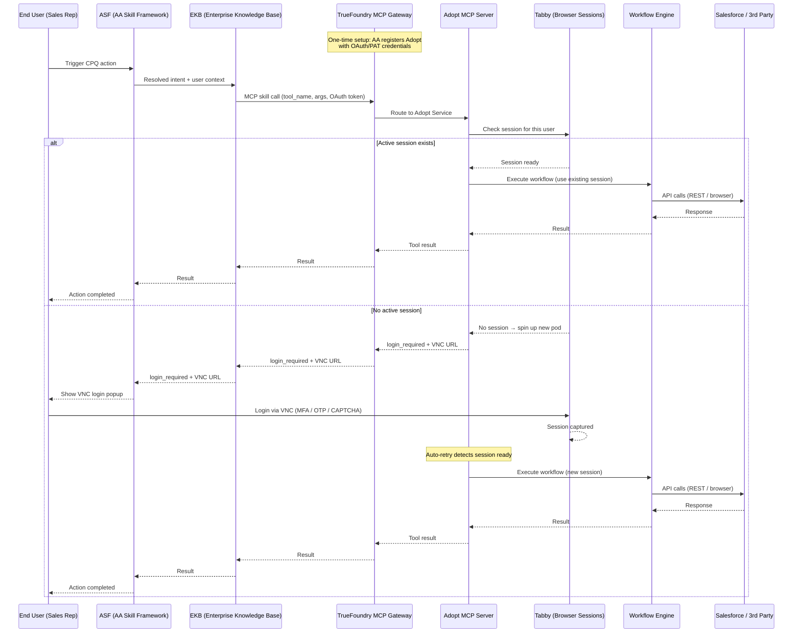
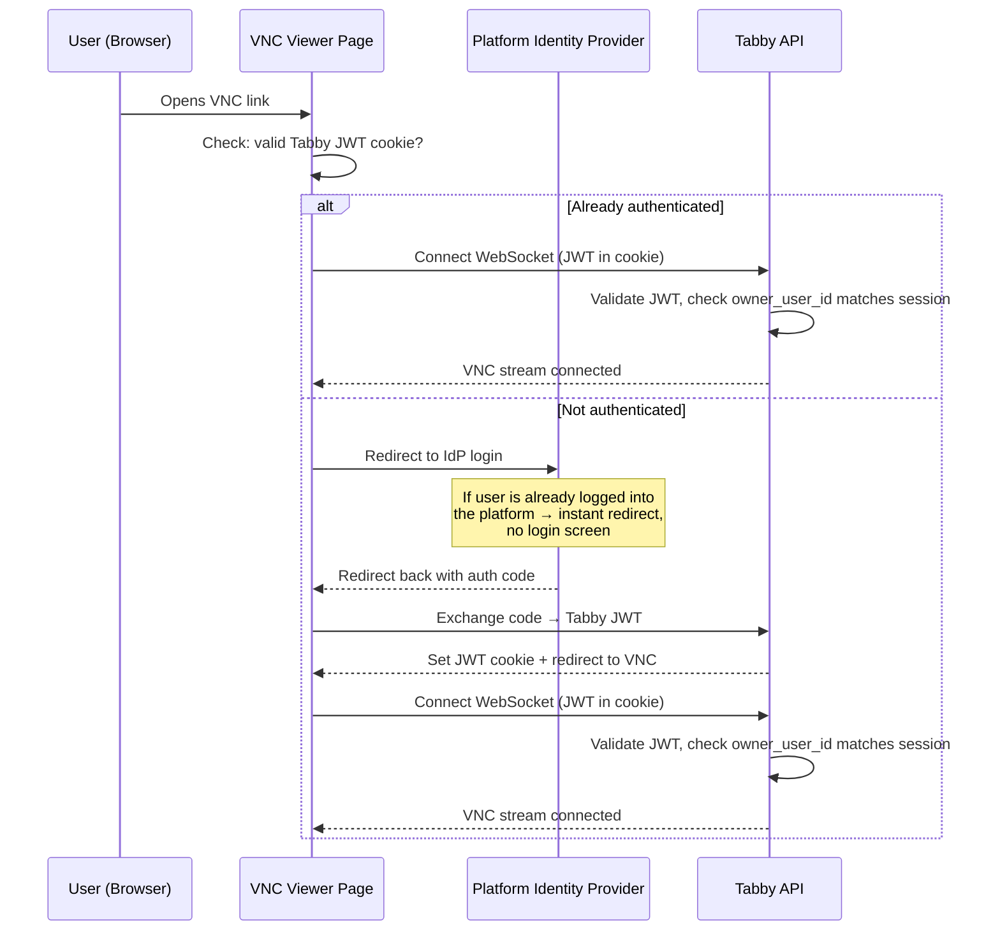

# Tabby — Architecture & Session Security

## Integration Flow

---

## VNC Access — User Authentication

When the user receives a VNC link to log in, the session is protected by an identity verification gate:

If the user is already logged into the platform, the redirect is instant — they click the VNC link and are connected without seeing a login screen.

If someone else receives the VNC link, they hit the platform login wall and cannot access the session without valid credentials for the organization.

**Fallback:** If OAuth is not configured, the viewer prompts the user to enter their email. Tabby validates the email against the session owner before allowing access.

---

## Session Isolation

### Per-User Isolation

Every browser session is bound to a specific user identity:

- Sessions are scoped to `owner_user_id` (derived from the caller's JWT)
- User A cannot see or access User B's sessions
- All API endpoints filter by `owner_user_id` — cross-user access is impossible at the query level

### Pod-Level Isolation

Each session runs in its own Kubernetes pod:

- Dedicated Chromium instance — no shared browser state between sessions
- Separate network namespace — pods cannot communicate with each other
- NetworkPolicy enforcement — each worker pod can only reach the target application's domains
- Non-root execution — all Linux capabilities dropped

### Credential Protection

Extracted credentials (cookies, tokens, CSRF) are:

- Encrypted at rest with AES-256-GCM
- Stored in tenant-scoped buckets
- Accessible only via authenticated API calls matching the session's `owner_user_id`
- Never exposed through the VNC viewer

### Tenant Isolation

All data is scoped by tenant:

- Sessions, applications, profiles, users, and credentials are all tenant-scoped
- Cross-tenant access is impossible at the database query level
- Each tenant has its own encrypted storage bucket

---

## VNC Link Protection Summary

| Layer | Protection |
|-------|-----------|
| **Identity verification** | VNC viewer requires authentication via the organization's IdP (OAuth redirect) before connecting |
| **Session ownership** | After authentication, Tabby validates the user's identity matches the session owner |
| **Stream token TTL** | VNC links contain a short-lived signed JWT (10 minutes) — expired links are rejected |
| **Credential isolation** | Extracted credentials are never visible through VNC — they are encrypted and served only through authenticated API calls |
| **Pod isolation** | Each session runs in its own pod with NetworkPolicy restricting network access |
| **Fallback** | Email verification gate when OAuth is not configured |
