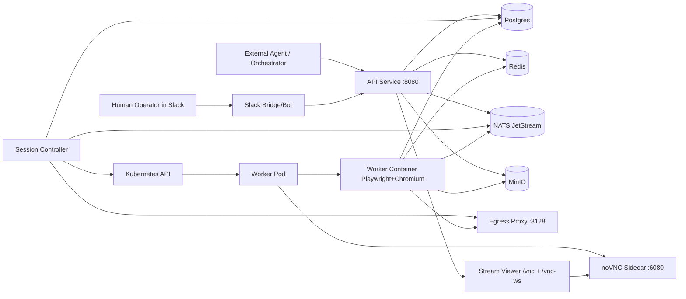
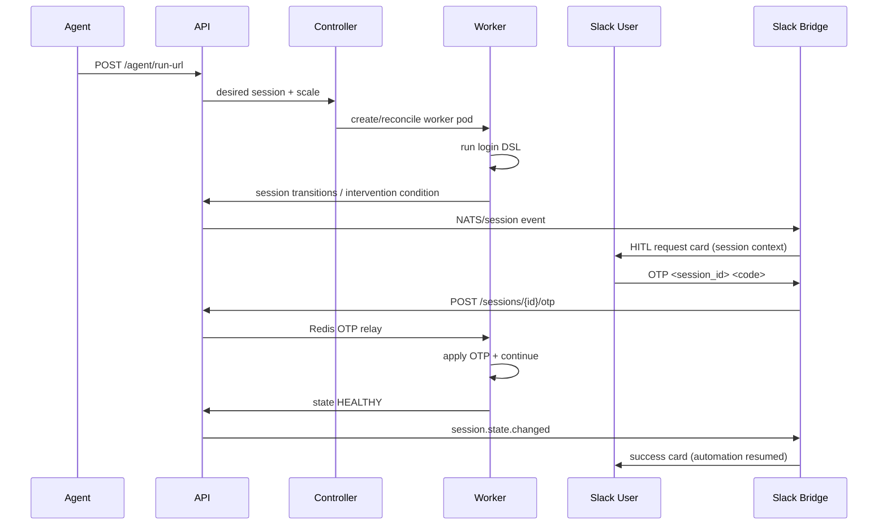

# Architecture and Infrastructure

**Date:** 2026-02-19
**Source basis:** live cluster snapshot (`kubectl`), chart defaults (`charts/browser-hitl/values.yaml`), worker template configmap, and phase evidence.

## 1. Logical Architecture

## 2. HITL Sequence (PoC)

## 3. Runtime Inventory (Current Cluster Snapshot)

Namespace: `browser-hitl`

### 3.1 Active Deployments/StatefulSets

| Kind | Name | Replicas | Image |
|---|---|---:|---|
| Deployment | `browser-hitl-api` | 1 | `browser-hitl/api:phase4c` |
| Deployment | `browser-hitl-controller` | 1 | `browser-hitl/controller:phase3d2` |
| Deployment | `browser-hitl-egress-proxy` | 1 | `node:20-alpine` |
| Deployment | `test-harness` | 1 | `browser-hitl/test-harness:phase4u1` |
| StatefulSet | `browser-hitl-postgres` | 1 | `postgres:16-alpine` |
| StatefulSet | `browser-hitl-redis` | 1 | `redis:7-alpine` |
| StatefulSet | `browser-hitl-nats` | 1 | `nats:2.10-alpine` |
| StatefulSet | `browser-hitl-minio` | 1 | `minio/minio:latest` |

### 3.2 Dynamic Worker Session Services

Per session, controller/runtime creates:
1. Worker pod with two containers: `worker` + `novnc`.
2. Session-specific noVNC service (e.g., `worker-<session-id>-novnc`, port `6080`).

### 3.3 Chart-defined components not active in this runtime snapshot

These are part of the Helm architecture model but were not active in the queried cluster state.

| Component | Default chart state | Default resources (request/limit) |
|---|---|---|
| Slack Bot | `enabled: true` (chart default) | `250m/256Mi` -> `500m/512Mi` |
| Teams Bot | `enabled: true` (chart default) | `250m/256Mi` -> `500m/512Mi` |
| Admin UI | `enabled: true` (chart default) | `250m/256Mi` -> `500m/512Mi` |

## 4. Resource Requirements

### 4.1 Baseline service resources (active snapshot)

| Service | CPU Request | Mem Request | CPU Limit | Mem Limit |
|---|---:|---:|---:|---:|
| API | 500m | 512Mi | 1 | 1Gi |
| Controller | 500m | 512Mi | 1 | 1Gi |
| Egress Proxy | 100m | 128Mi | 500m | 512Mi |
| Test Harness (PoC) | 50m | 64Mi | 250m | 256Mi |
| Postgres | 500m | 512Mi | 1 | 1Gi |
| Redis | 250m | 256Mi | 500m | 512Mi |
| NATS | 250m | 256Mi | 500m | 512Mi |
| MinIO | 250m | 256Mi | 500m | 512Mi |

### 4.2 Worker pod template resources (per session)

| Container | CPU Request | Mem Request | CPU Limit | Mem Limit |
|---|---:|---:|---:|---:|
| Worker | 1000m | 2Gi | 2000m | 3Gi |
| noVNC | 100m | 128Mi | 250m | 256Mi |
| **Total per session** | **1.1 CPU** | **2.125 GiB** | **2.25 CPU** | **3.25 GiB** |

### 4.3 Persistent volume allocations

| PVC | Size |
|---|---:|
| `data-browser-hitl-postgres-0` | 20Gi |
| `data-browser-hitl-redis-0` | 5Gi |
| `data-browser-hitl-nats-0` | 10Gi |
| `data-browser-hitl-minio-0` | 50Gi |

### 4.4 Full chart service resource profile (all services)

For capacity planning, include potential bot/admin workloads even if currently disabled.

| Service | CPU Request | Mem Request | CPU Limit | Mem Limit |
|---|---:|---:|---:|---:|
| API | 500m | 512Mi | 1 | 1Gi |
| Controller | 500m | 512Mi | 1 | 1Gi |
| Worker (per session) | 1000m | 2Gi | 2000m | 3Gi |
| noVNC (per session) | 100m | 128Mi | 250m | 256Mi |
| Slack Bot | 250m | 256Mi | 500m | 512Mi |
| Teams Bot | 250m | 256Mi | 500m | 512Mi |
| Admin UI | 250m | 256Mi | 500m | 512Mi |
| Postgres | 500m | 512Mi | 1 | 1Gi |
| Redis | 250m | 256Mi | 500m | 512Mi |
| NATS | 250m | 256Mi | 500m | 512Mi |
| MinIO | 250m | 256Mi | 500m | 512Mi |
| Egress Proxy | 100m | 128Mi | 500m | 512Mi |

## 5. Capacity Model for 50-100 Workers

### 5.1 Approximate total compute (excluding Kubernetes/system overhead)

Assumptions:
1. Baseline requests (without test harness) approx `2.35 CPU`, `2.43 GiB`.
2. Worker session request profile from template (`1.1 CPU`, `2.125 GiB`).

| Concurrent Worker Sessions | CPU Requests | Memory Requests | CPU Limits | Memory Limits |
|---:|---:|---:|---:|---:|
| 50 | ~57.35 cores | ~108.7 GiB | ~117.5 cores | ~167.8 GiB |
| 100 | ~112.35 cores | ~214.9 GiB | ~230.0 cores | ~330.3 GiB |

### 5.2 Practical architecture implications
1. Current single-node (8 vCPU, ~24 GiB) PoC cluster is far below 50-worker target.
2. Production target requires multi-node worker pools with headroom, pod anti-affinity, and preemption policy design.
3. Control-plane and stateful services should be separated from worker node pool.

## 6. Networking and Trust Boundaries

1. API provides control and signed stream URL issuance.
2. Stream websocket path (`/vnc-ws`) is proxied by API to session noVNC service.
3. Worker egress should be constrained through egress proxy and network policy model.
4. Session-scoped stream tokens are single-use (CAS), fail-closed when token state cannot be validated.

## 7. Current Infrastructure Gaps to Production

1. No HPA/KEDA objects currently deployed in this snapshot.
2. Stateful services are single-replica (no HA in this environment).
3. Slack/Teams/admin-ui pods are not currently deployed in-cluster snapshot.
4. Public-base stream URL and ingress hardening still environment-specific.

## 8. Recommended Production Topology

1. Dedicated node pool for workers (autoscaled), tainted and isolated.
2. Separate node pool for API/controller/bots.
3. Stateful backend moved to HA-managed services or replicated operators.
4. Ingress/TLS termination with strict authn/authz on stream and control APIs.
5. Horizontal scaling controls:
- API/controller HPA on CPU + request rate.
- Worker scale driven by desired session count and intervention queue signals.
